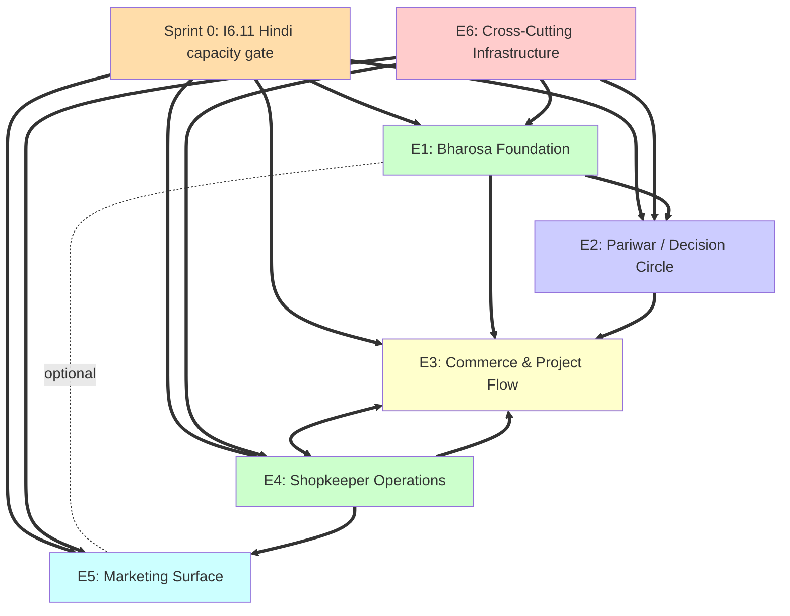

# Epics & Stories Listing — Yugma Dukaan v1

**The structured backlog Amelia builds from. Re-derived from PRD v1.0.5 + SAD v1.0.4 with sprint planning, dependency graphs, and complexity sizing.** *(v1.2: Phase 3 back-fill re-derivation — 8 new stories folded in, Sprint 0 precondition gate added, Sprint 1/5/6 re-sequenced, Standing Rule 11 added.)*

---

## §1 — Backlog Summary

### Counts

| Metric | Value |
|---|---|
| **Total v1 unique stories** | **67** *(Phase 6 IR Check v1.2 patch 2026-04-11 — arithmetic flag resolved. Per-epic breakdown `12 + 13 + 8 + 12 + 17 + 5 = 67` is canonical. The PRD v1.0.5 "58 → 66" patch note used the v1.0 baseline (58) instead of the v1.1 baseline (59 post-S4.13) when adding the 8 new v1.0.5 stories. PRD headline patched from 66 to 67 by Phase 6 IR Check. v1.1 had 59, v1.0 had 58.)* |
| **Walking Skeleton (Month 3 gate)** | **19** *(v1.2 patch: +I6.12 offline field-partition discipline per SAD v1.0.4 §9; was 18 in v1.1)* |
| **v1.5 deferred items** | 8 *(unchanged — S4.14 Bulk CSV import still deferred; none of the 8 new v1.0.5 stories push v1.5 scope)* |
| **v2 deferred items** | 7 |
| **Stories per epic** | E6: **12**, E1: **13**, E2: 8, E3: **12**, E4: **17**, E5: 5 |
| **Standing rules (backlog-wide)** | **11** *(v1.2 patch: +Standing Rule 11 Project field-partition discipline per PRD v1.0.5 preamble)* |

> **Story count reconciled with PRD v1.0.5.** The three historical inconsistencies flagged in v1.0 (PRD footer "47", S4.14, B1.6 deps) are all resolved: PRD v1.0.5 footer now reports 67 *(Phase 6 IR Check v1.2 patch corrected from stale 66)*, S4.14 sits cleanly in v1.5, B1.6 deps have been corrected to `S4.1, S4.3`. §12 (legacy inconsistency list) is retained as historical record only.

### Stories per auth tier

| Tier | Count | Stories |
|---|---|---|
| `noAuth` | **6** | All E5 marketing site stories + **I6.11** *(v1.2: governance gate, operational artifact)* |
| `anonymous` | 14 | E1 customer-facing browse + E2 Pariwar customer-facing + E3 customer-facing pre-commit |
| `phoneVerified` (or `eitherCustomer`) | **13** | E3 commit-and-after stories + E1 returning-customer stories + **B1.13** (Devanagari invoice) + **C3.12** (shop deactivation banner) |
| `googleOperator` | **31** | All E4 ops app stories + shopkeeper-side variants of E1/E2/E3 + **S4.16 / S4.17 / S4.18 / S4.19** |
| N/A (infrastructure) | **2** | E6 stories that don't directly serve a user + **I6.12** *(cross-tier — anonymous + phoneVerified + googleOperator foundation)* |

### Stories per adapter dependency

| Adapter | Story count |
|---|---|
| **AuthProvider** | 6 (I6.1, I6.2, I6.3, C3.4, S4.1, S4.2) |
| **CommsChannel** | 6 (I6.5, P2.4, P2.5, P2.6, C3.3, S4.8) |
| **MediaStore** | **12** (I6.6, B1.2, B1.3, B1.5, B1.6, B1.7, B1.8, S4.5, M5.2, M5.3, plus Golden Hour pipeline shops, **+ S4.16** *v1.2: extends the adapter contract per ADR-014 — mandatory counter-increment side effect on every successful upload*) |
| None | 42 |

### Stories per feature flag

| Flag | Story count | Stories |
|---|---|---|
| `decisionCircleEnabled` | 4 | P2.1, P2.2, P2.7, plus implicit fallback in P2.8 |
| `guestModeEnabled` | 2 | P2.2, P2.3 |
| `otpAtCommitEnabled` | 2 | I6.2 (sets up the swappable flow), C3.4 (consumes it) |
| `commsChannelStrategy` | 4 | I6.5, P2.4, P2.5, S4.8 |
| `authProviderStrategy` | 1 | I6.1 |
| `mediaStoreStrategy` | **2** | I6.6, **S4.16** *(v1.2: consumes the real-time kill-switch per I6.7 AC #7)* |
| **`defaultLocale`** *(v1.2)* | 1 | **I6.11** (governance gate; flips `"hi"` → `"en"` on Constraint 15 fallback) |
| **`cloudinary_uploads_blocked`** *(v1.2)* | 1 | **S4.16** (real-time kill-switch consumption via Firestore listener) |

### Cross-tenant integrity test required

**52 of 67 stories** require cross-tenant integrity test as part of acceptance criteria. *(Phase 6 IR Check v1.2 patch 2026-04-11: corrected from "53 of 66" — the exclusion list below was always 15 items, not 13. The 66↔67 arithmetic correction propagates here too.)* The **15** that don't:
- I6.1 (adapter scaffolding, no Firestore touch)
- I6.3 (refresh token, no Firestore touch)
- I6.7 (Remote Config, separate from Firestore)
- I6.9 (locale, no Firestore touch)
- I6.11 *(v1.2)* (governance artifact; 1 Remote Config write on fallback, no Firestore user data touch)
- B1.3 (audio file fetch only)
- B1.10 (audio file fetch only)
- P2.2, P2.3, P2.7, P2.8 (Decision Circle session state lives client-side)
- M5.1, M5.2, M5.3, M5.4 (marketing site is build-time fetch, no runtime Firestore)

*(Note: I6.12 explicitly ADDS new cross-tenant test cases — partition-crossing compile-time checks, security-rule replay checks — so it counts as Y for this table even though it is "infrastructure.")*

### Complexity sizing distribution

| Complexity | Count | Definition |
|---|---|---|
| **S** (small) | **20** | <2 days of focused work; single screen, simple CRUD |
| **M** (medium) | **26** | 2–5 days; multi-screen flow or non-trivial logic |
| **L** (large) | **14** | 5–10 days; integration-heavy, multi-system |
| **XL** (extra large) | **6** | 10+ days; foundational, blocks others, requires team coordination |

**XL stories (the 6 hardest):** I6.2 (UID merger), I6.4 (multi-tenant scoping), **I6.12 (offline field-partition discipline — v1.2 add)**, B1.1 (first-time onboarding), C3.4 (commit with Phone OTP upgrade), S4.2 (multi-operator concurrent access)

*v1.2 additions by complexity: I6.11 (S), I6.12 (XL), B1.13 (M), C3.12 (M), S4.16 (L), S4.17 (M), S4.18 (M), S4.19 (S).*

---

## §2 — Walking Skeleton Sprint Plan (Months 1–3)

The **19** Walking Skeleton stories sequenced into 6 two-week sprints *(v1.2: was 17, now 19 — I6.12 added as Sprint 1 foundational infra; I6.11 is a Sprint 0 precondition gate, not a Walking Skeleton story)*. This is the build order for the Month 3 technical gate per Brief §6. Depth stories from v1.0.5 (B1.13, C3.12, S4.16, S4.17, S4.18, S4.19) are not in the Walking Skeleton and are scheduled into Sprints 5–6 where the foundational commit/payment/dashboard work lands.

### Sprint 0 (Pre-Sprint, Weeks 0) — Precondition gates *(v1.2 add)*

**Goal:** Unblock Sprint 1 UX work. Nothing ships to production. This is a governance checkpoint, not an engineering sprint.

| Story | Complexity | Notes |
|---|---|---|
| **I6.11** Hindi-native design capacity verification gate *(v1.2 add)* | S | Governance artifact. Alok-signed `docs/runbook/hindi_design_capacity_verification.md` must exist before B1.1 / B1.2 / B1.3 enter the Sprint 2 backlog. If verification fails, `defaultLocale` Remote Config flag is flipped `"hi"` → `"en"` and Crashlytics logs `constraint_15_fallback_triggered`. This is NOT a Walking Skeleton story — it is a BLOCKER on every UX-touching epic (E1, E2, E3, E4, E5). |

**Sprint 0 exit criteria:** Verification artifact signed and committed, OR fallback path executed and logged. Either way, the posture is explicit before Sprint 1 kickoff. If neither happens by Sprint 1 Day 1, John halts Sprint 1 and escalates to Alok (per I6.11 AC #5).

### Sprint 1 (Weeks 1–2) — Foundation
**Goal:** Auth interface scaffolding, multi-tenant scoping, telemetry, field-partition discipline. Nothing user-visible yet.

| Story | Complexity | Notes |
|---|---|---|
| 🦴 **I6.1** AuthProvider adapter scaffolding | XL | Foundation for everything |
| 🦴 **I6.4** Multi-tenant shopId scoping | XL | Enables cross-tenant test in CI |
| 🦴 **I6.10** Crashlytics + Analytics + App Check | M | Standard observability setup |
| 🦴 **I6.12** Offline-first field-partition discipline *(v1.2 add)* | XL | Freezed sealed unions (`ProjectCustomerPatch` / `ProjectOperatorPatch` / `ProjectSystemPatch`), extended to `ChatThread` and `UdhaarLedger`. Repository-layer refactor alongside I6.4 — same engineer-week. Blocks C3.1, C3.4, C3.8, C3.9, P2.4, P2.5, S4.3, S4.8, S4.10 (every write-path story). |

**Sprint 1 exit criteria:** AuthProvider interface compiles. Synthetic shop_0 tenant exists. Cross-tenant integrity test runs and passes. **Freezed sealed unions for Project/ChatThread/UdhaarLedger field-partition compile and reject cross-partition patches at compile time** *(v1.2 add)*. Negative-compilation test cases in `test/fails_to_compile/` pass. CI is green.

### Sprint 2 (Weeks 3–4) — Auth flow + first user-visible screens
**Goal:** Anonymous → Phone Auth upgrade with refresh token persistence. First customer landing screen with Sunil-bhaiya's face.

| Story | Complexity | Notes |
|---|---|---|
| 🦴 **I6.2** Anonymous → Phone Auth UID merger | XL | Critical edge case handling |
| 🦴 **I6.3** Refresh token session persistence | M | Hard founder requirement |
| 🦴 **B1.1** First-time customer onboarding | XL | The most-load-bearing customer story |
| 🦴 **B1.2** Anonymous landing with shopkeeper face | M | Requires MediaStore adapter (Sprint 3) |

**Sprint 2 exit criteria:** Customer can install the app, see Sunil-bhaiya's face, and the auth state persists across cold launches. No OTP screen on returning visit.

### Sprint 3 (Weeks 5–6) — Bharosa visible + read paths + ops sign-in
**Goal:** Greeting voice note, curated shortlists, SKU detail. Shopkeeper signs in.

| Story | Complexity | Notes |
|---|---|---|
| 🦴 **B1.3** Greeting voice note auto-play | M | MediaStore + audio playback |
| 🦴 **B1.4** Curated occasion shortlists | L | Read-budget discipline holds |
| 🦴 **B1.5** SKU detail with Golden Hour photo | L | Asli-roop toggle |
| 🦴 **S4.1** Shopkeeper sign-in via Google | M | Operator role lookup |

**Sprint 3 exit criteria:** Customer can browse shortlists and view SKU details. Shopkeeper can sign into the ops app. Voice notes play.

### Sprint 4 (Weeks 7–8) — Project + chat happy path
**Goal:** Customer creates a Project draft, opens chat, sends a text message, shopkeeper sees it.

| Story | Complexity | Notes |
|---|---|---|
| 🦴 **C3.1** Create Project draft from SKU | M | Project entity write path |
| 🦴 **P2.4** Sunil-bhaiya Ka Kamra chat thread | L | CommsChannel adapter live |
| 🦴 **P2.5** Customer sends text message | M | First chat write path |
| 🦴 **S4.3** Inventory create new SKU | M | First ops write path |

**Sprint 4 exit criteria:** End-to-end chat works. Customer can create a Project. Shopkeeper can add inventory.

### Sprint 5 (Weeks 9–10) — Commit + payment + Golden Hour + telemetry trio + Bharosa depth
**Goal:** Customer commits and pays. Shopkeeper captures Golden Hour photos. Depth stories for telemetry and invoice land alongside the commit flow.

| Story | Complexity | Notes |
|---|---|---|
| 🦴 **C3.4** Commit Project with Phone OTP upgrade | XL | Auth upgrade integration. AC #4 Triple Zero invariant + AC #8 Standing Rule 11 compliance *(v1.0.5 PRD updates folded in)* |
| 🦴 **C3.5** UPI payment intent flow | L | UPI deep link + state transition. AC #8 UPI URI invariant — `am=` equals `totalAmount`, `pa=` equals `shop.upiVpa` *(v1.0.5 PRD update)* |
| 🦴 **S4.5** Golden Hour photo capture flow | M | MediaStore + camera UI |
| **S4.16** MediaStore cost-monitoring contract + ops dashboard *(v1.2 add)* | L | Extends MediaStore adapter contract with mandatory counter-increment side effect per ADR-014. Adds ops dashboard `मीडिया खर्च` tile. Depends on I6.6 (MediaStore scaffolding) + I6.7 (feature flag real-time consumption) + S4.11 (analytics dashboard host — deferred to this sprint as a small new section). Telemetry trio #1. |
| **S4.17** Shopkeeper NPS + burnout early warning *(v1.2 add)* | M | Bi-weekly dismissible dashboard card writes to `feedback` sub-collection. Crashlytics custom key on 2 consecutive scores ≤6. Telemetry trio #2. |
| **S4.18** Repeat-customer event tracking *(v1.2 add)* | M | `previousProjectIds` arrayUnion on commit (via `ProjectSystemPatch` Cloud Function per Standing Rule 11). New `दोबारा आने वाले ग्राहक` dashboard tile. Churn warning at <5% trailing 60-day repeat rate. Depends on C3.4 (this sprint) — land after C3.4 passes. Backfill script `tools/backfill_previous_project_ids.ts` runs once. Telemetry trio #3. |
| **B1.13** Devanagari invoice with Mukta-italic signature *(v1.2 add)* | M | Client-side PDF generation per ADR-015 (no Cloud Function). Depends on C3.4 (commit) + C3.5 (UPI payment complete) + I6.9 (Devanagari font subset). Land after C3.5 in-sprint. Bharosa depth, not telemetry — lands here because C3.12 reuses the invoice for DPDP data-export. |

**Sprint 5 exit criteria:** A real customer can complete a full purchase end-to-end via UPI. Golden Hour photos go from camera to customer-facing view. Cloudinary burn rate visible in ops dashboard. NPS card cycles bi-weekly. Repeat-purchase event fires on commit. Devanagari invoice PDF renders and shares via system share sheet.

*Scope note: Sprint 5 is deliberately heavy. Walking Skeleton stories (C3.4, C3.5, S4.5) take priority; if depth stories slip, they move to Sprint 6 alongside the deactivation pair.*

### Sprint 6 (Weeks 11–12) — Deactivation pair + integration test + Month 3 gate validation
**Goal:** Shop deactivation customer-notification workflow ships (DPDP Act 2023 compliance). Polish, fix bugs, run end-to-end integration test, validate Month 3 hard gate per Brief §6.

| Story | Complexity | Notes |
|---|---|---|
| **C3.12** Shop deactivation customer notification *(v1.2 add, paired with S4.19)* | M | Persistent Devanagari banner + state listener on `Shop.shopLifecycle` + FCM notification + DPDP audit analytics event. Depends on B1.13 (Sprint 5) for data-export CTA reuse. Must ship with S4.19 — ops-side write creates the state the customer-side listener reads. |
| **S4.19** Shopkeeper-triggered shop deactivation ops flow *(v1.2 add, paired with C3.12)* | S | 3-tap confirmation in Settings (S4.12), bhaiya-role-only, reversibility window until next `shopDeactivationSweep` run, audit trail write. Depends on S4.12 (ops Settings host). |

| Activity | Notes |
|---|---|
| End-to-end integration test through all **19** Walking Skeleton stories | Mary-coached customer journey allowed at this stage |
| Integration test of C3.12 + S4.19 deactivation pair | Flip test-tenant `shop_0` to `deactivating`, assert banner appears, assert `shopDeactivationSweep` pauses active Projects, assert DPDP notification fires |
| Devanagari rendering QA on 5 cheap-Android devices | Per Brief Constraint 15 + ADR-008 *(covers new B1.13 invoice template per AC edge case)* |
| Cross-tenant integrity test still green on all PRs | Per ADR-012 *(must cover new I6.12 partition-crossing cases)* |
| Bug fixing for any P0/P1 issues surfaced during integration | |
| Deploy to staging Firebase project | First real shopkeeper data load (if shop is ready) |
| **Month 3 hard gate validation** | Per Brief §6: one real customer completes a full journey |

**Sprint 6 exit criteria:** Brief §6 Month 3 technical gate met. Walking Skeleton ships (all 19 stories). Deactivation pair verifiable end-to-end against test tenant. The remaining ~45 stories enter the v1 backlog as parallel work for Months 4–9.

---

## §3 — Epic E6: Cross-Cutting Infrastructure

**Business value:** The platform plumbing that enables every other epic. Without E6, no other epic can ship.

**Total stories:** **12** *(v1.2: +I6.11 governance gate, +I6.12 offline field-partition discipline)*
**Walking Skeleton stories:** **6** (I6.1, I6.2, I6.3, I6.4, I6.10, **I6.12**) — *I6.11 is a Sprint 0 precondition gate, not a Walking Skeleton story*

| ID | 🦴 | Story (compressed) | Auth | Adapter | Flag | Reads | X-Tenant | Deps | Cmplx | Refs |
|---|---|---|---|---|---|---|---|---|---|---|
| **I6.1** | 🦴 | As an engineer, I want a swappable AuthProvider interface, so that auth can swap providers without rewriting screens | N/A | AuthProvider | `authProviderStrategy` | 0 | N | none | XL | Brief §10, SAD §4, ADR-002, R8 |
| **I6.2** | 🦴 | As Sunita-ji's son, I want my anonymous browse to upgrade to phone-verified at commit without losing state, so my Decision Circle survives | anon→phone | AuthProvider | `otpAtCommitEnabled` | 1 | N | I6.1, I6.3 | XL | SAD §4 Flow 1+4, ADR-002, R12 |
| **I6.3** | 🦴 | As a returning customer, I want the app to remember me, so I never see another OTP | phoneVerified | AuthProvider | none | 0 | N | I6.1 | M | SAD §4 Flow 2, founder req |
| **I6.4** | 🦴 | As a platform engineer, I want every Firestore document scoped by shopId with cross-tenant integrity tests in CI, so shop #2 can onboard without rewriting | N/A | none | none | 0 | **Y** (creates the test) | I6.1 | XL | SAD §5, §6, ADR-003, ADR-012, R9 |
| **I6.5** | | As an engineer, I want a swappable CommsChannel interface with Firestore default and WhatsApp fallback, so the chat surface can swap if R13 fires | N/A | CommsChannel | `commsChannelStrategy` | 0 | N | I6.1, I6.4 | L | SAD §1, ADR-005, R5, R13 |
| **I6.6** | | As an engineer, I want a swappable MediaStore interface with Cloudinary default and R2 stub, so catalog images can migrate when Cloudinary credit overage hits at shop #5–7 | N/A | MediaStore | `mediaStoreStrategy` | 0 | N | I6.1, I6.4 | L | SAD §1, ADR-006, R3 |
| **I6.7** | | As an engineer, I want all feature flags loaded from Remote Config at boot AND real-time kill-switch flags consumed via Firestore `onSnapshot` *(v1.0.5 PRD update — AC #7 split + AC #8 adapter consumer discipline per SAD ADR-007 v1.0.4)* | N/A | none | (creates the system) | 0 | N | I6.4 | M | SAD §1, §5 FeatureFlags, ADR-007 v1.0.4, ADR-009, R11/R12/R13 |
| **I6.8** | | As Yugma Labs, I want a kill-switch Cloud Function that disables expensive features when the $1/month cap is approached, so SMS pumping can't burn unexpected charges | N/A | none | All | 0 | N | I6.7 | M | SAD §7 Function 1, ADR-007 |
| **I6.9** | | As Sunita-ji, I want every screen in proper Devanagari with no clipping, so the app feels like it was built in my language | N/A | none | none | 0 | N | I6.4 | L | Brief Constraint 4+15, ADR-008, R9 fragility |
| **I6.10** | 🦴 | As Yugma Labs, I want Crashlytics + Analytics + Performance + App Check live on day one, so we have visibility from the first user | N/A | none | none | 0 | N | I6.1, I6.4, I6.7 | M | Brief §10, SAD §1, R8 |
| **I6.11** *(v1.2 add)* | | As the founder, I want a pre-design verification that Hindi-native design capacity is secured (or explicitly broken via runtime fallback), so Devanagari UX never ships without a qualified reviewer | noAuth | none | `defaultLocale` | 0 | N | none | S | Brief Constraint 15, Brief §12 Step 0.6, SAD ADR-008, audit gap #1 |
| **I6.12** *(v1.2 add)* | 🦴 | As platform engineering, I want compile-time Freezed sealed unions enforcing the SAD §9 customer/operator/system field partition on Project/ChatThread/UdhaarLedger, so a 3-day-offline replay cannot revert operator state | N/A (cross-tier infra) | none | none | 0 | **Y** (adds new partition-crossing test cases) | I6.1, I6.4 | XL | SAD v1.0.4 §9 field-partition table, ADR-004, Standing Rule 11, audit gap #8 |

### E6 dependency graph

```
I6.11 (Hindi design capacity verification — Sprint 0 precondition gate, v1.2 add)
  │  blocks every UX-touching epic (E1, E2, E3, E4, E5) until signed off or fallback triggered
  ▼
I6.1 (AuthProvider scaffolding)
  │
  ├─→ I6.2 (UID merger) ──→ I6.3 (refresh token persistence)
  │
  ├─→ I6.4 (multi-tenant + cross-tenant test)
  │     │
  │     ├─→ I6.5 (CommsChannel adapter)
  │     ├─→ I6.6 (MediaStore adapter)
  │     ├─→ I6.7 (Remote Config + Firestore real-time flags)
  │     │     │
  │     │     └─→ I6.8 (kill-switch Cloud Function)
  │     │
  │     ├─→ I6.9 (Hindi locale + Devanagari font)
  │     │
  │     └─→ I6.12 (offline field-partition sealed unions — v1.2 add)
  │           │  blocks C3.1, C3.4, C3.8, C3.9, P2.4, P2.5, S4.3, S4.8, S4.10
  │           │  (every story that writes to Project, ChatThread, or UdhaarLedger)
  │
  └─→ I6.10 (Crashlytics + Analytics + App Check)
```

**E6 critical path:** I6.11 (Sprint 0) → I6.1 → I6.4 → **I6.12** → I6.7 → I6.8. **Everything in E6 must be done or in flight before any other epic begins serious work. I6.12 specifically gates every write-path story in E2 / E3 / E4.**

---

## §4 — Epic E1: Bharosa Foundation

**Business value:** The shopkeeper-as-product layer. Sunil-bhaiya's voice, face, curation, memory, and honest absence are the experience. The almirahs are background.

**Total stories:** **13** *(v1.2: +B1.13 Devanagari invoice with shopkeeper signature)*
**Walking Skeleton stories:** 5 (B1.1, B1.2, B1.3, B1.4, B1.5)

| ID | 🦴 | Story (compressed) | Auth | Adapter | Flag | Reads | X-Tenant | Deps | Cmplx | Refs |
|---|---|---|---|---|---|---|---|---|---|---|
| **B1.1** | 🦴 | As a first-time visitor, I want to land in the app and see Sunil-bhaiya immediately, so I trust this is real | anonymous | AuthProvider | none | 3 | Y | I6.1, I6.4, I6.10, B1.2, B1.3 | XL | Brief §1, §3 Bharosa, locked PQ2 |
| **B1.2** | 🦴 | As Sunita-ji's son, I want the first screen to be Sunil-bhaiya's face and name in Devanagari, so I know I'm in his shop | anonymous | MediaStore | none | (in B1.1) | Y | I6.6, B1.1 | M | Brief §3, §4.3, ADR-006 |
| **B1.3** | 🦴 | As Sunita-ji, I want to hear Sunil-bhaiya welcome me in his actual voice, so I trust this is a human | anonymous | MediaStore | none | (in B1.1) | N | I6.6, B1.2 | M | Brief §3 Bharosa, B1.10 |
| **B1.4** | 🦴 | As Sunita-ji's son, I want to see Sunil-bhaiya's curated picks for weddings/new homes/dahej, so I don't browse 200 SKUs | anonymous | MediaStore | none | 5 | Y | I6.4, I6.6, B1.2 | L | Brief §3, SAD §5 CuratedShortlist, locked PQ5 |
| **B1.5** | 🦴 | As Sunita-ji, I want to see the almirah in its Sunday-best lighting, so I can judge whether to visit in person | anonymous | MediaStore | none | 2 | Y | I6.6, B1.4 | L | Brief §3 Golden Hour, SAD §5 GoldenHourPhoto, ADR-006 |
| **B1.6** | | As Sunil-bhaiya (ops app), I want to record a one-tap voice note about an SKU, so customers hear me explain it | googleOp | MediaStore | none | 1 | Y | S4.1, S4.3 | M | Brief §3, SAD §5 VoiceNote, locked PQ4 |
| **B1.7** | | As Sunil-bhaiya, I want to drop a voice note in a customer's chat thread, so I can answer in my voice | googleOp | MediaStore + CommsChannel | none | 1 | Y | I6.5, I6.6, S4.9 | M | SAD §5 VoiceNote, ADR-005 |
| **B1.8** | | As Sunil-bhaiya (bhaiya only), I want to update the welcome voice note customers hear, so I can change my greeting for festivals | googleOp (bhaiya) | MediaStore | none | 1 | Y | I6.6, S4.14 | S | Brief §3 Bharosa landing, B1.3 |
| **B1.9** | | As Sunita-ji, I want the app to tell me honestly when Sunil-bhaiya isn't available right now | anonymous + googleOp | none | none | 1 | Y | S4.1, S4.14 | M | Brief §3 Absence Presence, SAD §5 Shop |
| **B1.10** | | As Sunita-ji, I want to hear Sunil-bhaiya's pre-recorded "I'm at a wedding" voice note, so absence still feels personal | anonymous | MediaStore | none | 1 | N | B1.6, B1.9 | S | Brief §3 Bharosa Absence-as-Presence |
| **B1.11** | | As Sunil-bhaiya, I want to write private notes about each customer, so I can pick up the relationship from where it left off | googleOp | none | none | 1 | **Y (critical: customer never reads)** | I6.4, S4.11 | M | SAD §5 CustomerMemory, SAD §6 |
| **B1.12** | | As Sunil-bhaiya, I want a single screen to one-tap reorder my curation across all 6 shortlists, so updates are a 30-second daily ritual | googleOp | none | none | 7 | Y | S4.1, S4.3 | L | Brief §3 "Remote control", locked PQ5 |
| **B1.13** *(v1.2 add)* | | As Sunita-ji (post-delivery), I want a dignified Devanagari invoice with Sunil-bhaiya's signature in Mukta italic — savable as PDF, shareable via WhatsApp — so I have a physical-looking record that honors the shopkeeper's identity | phoneVerified | none (client-side PDF per ADR-015) | none | 3 | Y | I6.4, I6.9, C3.4, C3.5, S4.12 | M | Brief §3 Bharosa "plain dignified invoices", SAD v1.0.4 ADR-015, Brief Constraint 4 font stack, audit gap #4 |

### E1 dependency graph

```
B1.1 (first-time onboarding)
  ├─→ B1.2 (landing with face)
  │     └─→ B1.3 (greeting voice note)
  │           └─→ B1.4 (curated shortlists)
  │                 └─→ B1.5 (SKU detail)
  │
  └─→ (parallel) B1.6 (voice note recording, ops side)
                  └─→ B1.7 (voice note in chat) ──→ B1.8 (greeting update)
                  └─→ B1.10 (absence voice note) ──→ B1.9 (absence banner)

  └─→ (independent) B1.11 (customer memory)
  └─→ (independent) B1.12 (curation editing UX)
  └─→ (independent) B1.13 (Devanagari invoice PDF — needs C3.5 payment complete, v1.2 add)
```

**E1 critical path for Walking Skeleton:** B1.1 → B1.2 → B1.3 → B1.4 → B1.5. **B1.13 is post-commit depth** — lands in Sprint 5 after C3.5 (UPI payment) ships.

---

## §5 — Epic E2: Pariwar / Decision Circle

**Business value:** Committee-native browse + chat. The committee is the unit of decision-making; the device is shared, the personas rotate, the shopkeeper is the gravitational center.

**Total stories:** 8
**Walking Skeleton stories:** 2 (P2.4, P2.5)

| ID | 🦴 | Story (compressed) | Auth | Adapter | Flag | Reads | X-Tenant | Deps | Cmplx | Refs |
|---|---|---|---|---|---|---|---|---|---|---|
| **P2.1** | | As Sunita-ji, I want my family's decision-making tracked as a single thread, so nobody repeats themselves | anonymous | none | `decisionCircleEnabled` | 1 | Y | I6.4, I6.7, C3.1 | M | Brief §3 Pariwar, SAD §5 DecisionCircle, ADR-009, R11 |
| **P2.2** | | As the device-holder, I want to toggle to "Mummy-ji is looking" before handing the phone to my mother | anonymous | none | `guestModeEnabled` | 0 | N | I6.7, P2.1 | S | Brief §3 Guest Mode, ADR-009 |
| **P2.3** | | As Mummy-ji, I want the screen to be readable, slow, and respectful when I'm looking at it | anonymous | none | `guestModeEnabled` | 0 | N | I6.9, P2.2 | M | Brief §3 Guest Mode |
| **P2.4** | 🦴 | As Sunita-ji's son, I want a single chat thread per Project where Sunil-bhaiya talks to all of us | anonymous | CommsChannel | `commsChannelStrategy` | 11 | Y | I6.4, I6.5, C3.1, P2.1 | L | Brief §3, SAD §5 ChatThread+Message, ADR-005 |
| **P2.5** | 🦴 | As Sunita-ji's son, I want to type a question in Hindi and send it to Sunil-bhaiya | anonymous | CommsChannel | `commsChannelStrategy` | 0 | Y | P2.4 | S | SAD §5 Message, ADR-005 |
| **P2.6** | | As Sunita-ji, I want to play Sunil-bhaiya's voice notes inline in the chat | anonymous | MediaStore | none | 0 | N | I6.6, P2.4 | S | B1.7 companion |
| **P2.7** | | As the device-holder, I want to know which family members have seen which messages | anonymous | none | `decisionCircleEnabled` | 0 | N | P2.1, P2.4 | S | SAD §5 Message.readByUids |
| **P2.8** | | As Sunita-ji, I want the larger text and slower pacing even if Decision Circle isn't running, because my eyes are 52 | anonymous | none | none (universal fallback) | 0 | N | I6.9, P2.3 | S | R11 fallback |

### E2 dependency graph

```
I6.7 (feature flags)
  │
  └─→ P2.1 (Decision Circle creation)
        ├─→ P2.2 (Guest Mode toggle)
        │     └─→ P2.3 (elder UI tier rendering)
        │           └─→ P2.8 (universal large-text fallback)
        │
        └─→ P2.4 (Sunil-bhaiya Ka Kamra chat thread) — also needs C3.1 (Project)
              ├─→ P2.5 (customer text message)
              ├─→ P2.6 (voice note rendering)
              └─→ P2.7 (multi-participant read tracking)
```

**E2 critical path for Walking Skeleton:** I6.5 (CommsChannel) → C3.1 → P2.4 → P2.5

**R11 risk note:** If field validation in Months 3–5 shows that real families don't use Guest Mode (committees video-call instead of pass phones), stories P2.1, P2.2, P2.3, P2.7 are dropped via Remote Config and the architecture survives unchanged. Only P2.4, P2.5, P2.6, P2.8 remain.

---

## §6 — Epic E3: Commerce & Project Flow

**Business value:** The actual buying. The integration epic — touches every other epic. Project creation, line items, negotiation via chat, commit with Phone OTP, UPI/COD/bank/udhaar, delivery tracking, **and v1.2: shop deactivation customer-notification workflow (DPDP Act 2023 compliance)**.

**Total stories:** **12** *(v1.2: +C3.12 shop deactivation customer notification, paired with S4.19 ops side)*
**Walking Skeleton stories:** 3 (C3.1, C3.4, C3.5)

| ID | 🦴 | Story (compressed) | Auth | Adapter | Flag | Reads | X-Tenant | Deps | Cmplx | Refs |
|---|---|---|---|---|---|---|---|---|---|---|
| **C3.1** | 🦴 | As Sunita-ji's son, I want to start an order for a specific almirah Sunil-bhaiya recommended | anonymous | none | none | 1 | Y | I6.4, B1.5 | M | SAD §5 Project, Brief §3 |
| **C3.2** | | As Sunita-ji's son, I want to add a dressing table to the order, change quantity, or remove an item | anonymous | none | none | 0 | Y | C3.1 | S | SAD §5 Project + LineItem |
| **C3.3** | | As Sunita-ji's son, I want to ask Sunil-bhaiya for a discount in chat with his counter-offer recorded against the Project | anonymous | CommsChannel | none | 0 | Y | C3.2, P2.5 | M | Brief §5, P2.5 |
| **C3.4** *(v1.0.5 updated)* | 🦴 | As Sunita-ji's son, I want to "place the order" once family agrees, with Phone OTP at commit. **AC #4 Triple Zero invariant:** `amountReceivedByShop == totalAmount` enforced in the commit transaction. **AC #8 Standing Rule 11:** commit is a `ProjectOperatorPatch` with a special-cased customer-path exception for `draft → committed` only | anon→phone | AuthProvider | `otpAtCommitEnabled` | 1 | Y | I6.2, I6.7, **I6.12**, C3.1, C3.2 | XL | SAD §4 Flow 1, ADR-002, ADR-009, R12, SAD v1.0.4 §5 Project schema finding F3 |
| **C3.5** *(v1.0.5 updated)* | 🦴 | As Sunita-ji's son, I want to pay via PhonePe/GPay/Paytm with one tap. **AC #8 Triple Zero UPI invariant:** `am=` equals `totalAmount` EXACTLY; `pa=` equals `shop.upiVpa` directly; no commission / fee / MDR parameter in URI | phoneVerified | none | none | 1 | Y | C3.4 | L | Brief §3 UPI-first, locked PQ3, SAD v1.0.4 §5 finding F3 |
| **C3.6** | | As Geeta-ji, I want to pay cash when the almirah arrives | phoneVerified | none | none | 0 | Y | C3.4 | S | Brief §3 COD, Brief §5 Persona C |
| **C3.7** | | As Amit-ji, I want to pay via direct bank transfer if my UPI limit is exhausted | phoneVerified | none | none | 0 | Y | C3.4 | S | Brief §3 |
| **C3.8** | | As Sunil-bhaiya, I want to extend partial-payment udhaar to a customer I trust | googleOp + phoneVerified | none | none | 1 | Y (critical: forbidden vocabulary check) | C3.4, S4.12 | M | Brief §3, ADR-010, R10 |
| **C3.9** | | As Sunil-bhaiya, I want to record each installment Sunita-ji's family pays | googleOp | none | none | 1 | Y | C3.8 | S | SAD §5 UdhaarLedger, ADR-010 |
| **C3.10** | | As Sunita-ji's son, I want to see exactly where my order is in the process | phoneVerified | none | none | 1 | Y | C3.4 | M | SAD §5 Project.state |
| **C3.11** | | As Sunil-bhaiya, I want to mark an order as delivered with optional photo | googleOp | MediaStore | none | 1 | Y | I6.6, S4.8 | S | SAD §5 Project.deliveredAt |
| **C3.12** *(v1.2 add, paired with S4.19)* | | As Sunita-ji (customer), I want an honest Devanagari banner + FCM notification when Sunil-bhaiya's shop is closing — with paused active orders, frozen udhaar, DPDP-retention explanation, and a data-export CTA — so I am never left wondering what happened | phoneVerified | none | none | 2 | Y | I6.4, I6.7, **B1.13** (for data-export reuse), **S4.19** paired | M | Brief §9 R16 DPDP, SAD v1.0.4 ADR-013, SAD §5 Shop lifecycle fields, SAD §7 Function 8 `shopDeactivationSweep`, DPDP Act 2023, audit gap #2 |

### E3 dependency graph

```
B1.5 (SKU detail)
  └─→ C3.1 (Project draft) — also needs I6.12 field-partition (v1.2)
        ├─→ C3.2 (line item edit) ──→ C3.3 (negotiation in chat — also needs P2.5)
        │
        └─→ C3.4 (commit with Phone OTP) — also needs I6.2, I6.12
              ├─→ C3.5 (UPI payment)
              │     └─→ B1.13 (Devanagari invoice PDF — v1.2)
              │           └─→ C3.12 (shop deactivation data-export reuse — v1.2)
              ├─→ C3.6 (COD)
              ├─→ C3.7 (bank transfer)
              ├─→ C3.8 (udhaar setup) ──→ C3.9 (udhaar payment record) — both need I6.12
              ├─→ C3.10 (order tracking)
              ├─→ C3.11 (delivery confirmation — also needs S4.8)
              └─→ C3.12 (shop deactivation customer notification — paired with S4.19, v1.2)
```

**E3 critical path for Walking Skeleton:** B1.5 → C3.1 → C3.4 → C3.5. **Depth extension (v1.2):** C3.5 → B1.13 → C3.12 (Sprint 5 → Sprint 6 pipeline for DPDP workflow).

**Integration story note:** C3.4 is the highest-risk story in v1. It integrates AuthProvider (I6.2), feature flags (I6.7), Project state machine, and the OTP-cultural-risk fallback (R12). Allocate Sprint 5 entirely to it + the surrounding payment stories.

---

## §7 — Epic E4: Shopkeeper Operations

**Business value:** The ops app — Sunil-bhaiya's command center. Multi-operator from day one. Inventory, orders, chat reply, curation, customer memory, udhaar, settings, **and v1.2: cost telemetry, NPS + burnout early warning, repeat-customer analytics, shop deactivation ops flow**.

**Total stories:** **17** *(v1.2: +S4.16 MediaStore cost monitor, +S4.17 NPS survey + burnout warning, +S4.18 repeat-customer tracking, +S4.19 ops-side shop deactivation; S4.13 "Today's task" already in v1.1; S4.14 Bulk CSV import remains v1.5-deferred; S4.15 reserved)*
**Walking Skeleton stories:** 3 (S4.1, S4.3, S4.5)

| ID | 🦴 | Story (compressed) | Auth | Adapter | Flag | Reads | X-Tenant | Deps | Cmplx | Refs |
|---|---|---|---|---|---|---|---|---|---|---|
| **S4.1** | 🦴 | As Sunil-bhaiya, I want to sign into the ops app with my Gmail | googleOp | AuthProvider | none | 1 | Y | I6.1 | M | SAD §4 Flow 3, ADR-002 |
| **S4.2** | | As Aditya (the nephew, beta role), I want my own login that respects my role | googleOp | none | none | 1 | Y | S4.1 | XL | SAD §5 Operator, SAD §6 |
| **S4.3** | 🦴 | As Aditya, I want to add a new almirah to the catalog in <90 seconds | googleOp | MediaStore | none | 0 | Y | S4.1, S4.5 | M | SAD §5 InventorySku |
| **S4.4** | | As Aditya, I want to update an SKU's price or stock count | googleOp (bhaiya/beta) | none | none | 1 | Y | S4.3 | S | SAD §5 InventorySku |
| **S4.5** | 🦴 | As Aditya, I want to photograph an almirah during golden hour with one-tap auto-upload | googleOp | MediaStore (Cloudinary) | none | 0 | Y | I6.6, S4.3 | M | Brief §3, SAD §5 GoldenHourPhoto, ADR-006 |
| **S4.6** | | As Sunil-bhaiya, I want all active Projects at a glance, filterable by state | googleOp | none | none | 5 | Y | S4.1 | M | SAD §5 Project, indexes |
| **S4.7** | | As Sunil-bhaiya, I want everything about a customer's order on one screen | googleOp | none | none | 4 | Y | S4.6, B1.11 | L | SAD §5 Project + ChatThread + CustomerMemory |
| **S4.8** | | As Sunil-bhaiya, I want to reply to chat (text or voice note) | googleOp | CommsChannel + MediaStore | `commsChannelStrategy` | 0 | Y | I6.5, P2.4, S4.7 | M | P2.4, P2.5, B1.7 |
| **S4.9** | | As Sunil-bhaiya, I want to add a memory note about a customer while chatting | googleOp | none | none | 0 | **Y (customer never reads)** | B1.11, S4.7 | S | B1.11 |
| **S4.10** *(v1.0.5 updated)* | | As munshi, I want to see all open udhaar ledgers and record payments quickly — **with per-ledger opt-in** (`reminderOptInByBhaiya`, AC #7), **3-reminder lifetime cap** (`reminderCountLifetime`, AC #8), **shopkeeper-controlled 7–30 day cadence** (`reminderCadenceDays`, AC #9) — as RBI-defensive guardrails | googleOp (bhaiya/munshi) | none | none | 5 | Y | C3.9 | M | SAD §5 UdhaarLedger, ADR-010, SAD v1.0.4 §7 Function 3 RBI guardrails finding F11 |
| **S4.11** | | As Sunil-bhaiya, I want a dashboard of monthly orders, revenue, customers | googleOp | none | none | 6 | Y | S4.6 | M | Brief §6 success metrics |
| **S4.12** | | As Sunil-bhaiya (bhaiya only), I want to update tagline, photo, colors, feature flags from one screen | googleOp (bhaiya) | none | (this IS the meta UI) | 2 | Y | S4.1, B1.8, I6.7 | L | SAD §5 ShopThemeTokens + FeatureFlags |
| **S4.13** | | *(v1.0.4 add)* As Sunil-bhaiya, I want a "Today's task" screen telling me ONE thing to do today, so I always know how to use the app without thinking | googleOp | none | none | 1 | Y | S4.1, S4.3 | M | Onboarding Playbook §5 + §11; pre-mortem #1 mitigation |
| **S4.16** *(v1.2 add)* | | As platform engineering, I want every MediaStore upload to increment a per-shop counter and the ops dashboard to visualize monthly burn against Cloudinary 25-credit + Cloud Storage 5 GB ceilings with warn/alert thresholds, so `mediaCostMonitor` (SAD §7 Function 7) has real data and the Brief §6 Month 9 unit-economics gate is measurable | googleOp (bhaiya dashboard) | **MediaStore** *(extends adapter contract per ADR-014)* | `cloudinary_uploads_blocked`, `mediaStoreStrategy` (real-time Firestore listener per I6.7 AC #7) | 2 | Y | I6.6, I6.7, S4.11 | L | Brief §9 R3, SAD v1.0.4 ADR-014, SAD §7 Function 7 `mediaCostMonitor`, Brief §6 Month 9 gate, audit gap #3 |
| **S4.17** *(v1.2 add)* | | As platform engineering, I want a bi-weekly dismissible Devanagari NPS card in the ops app writing to the `feedback` sub-collection + Crashlytics burnout warning on 2 consecutive scores ≤6, so Brief §6 "shopkeeper NPS ≥8/10" and Brief R1 burnout kill-gate are measurable | googleOp | none | none | 1 | Y | S4.1, S4.6 | M | Brief §6 Month 6 success gate, Brief §9 R1 burnout kill-gate, SAD v1.0.4 §5 `feedback` sub-collection, SAD §6 feedback rule, audit gap #5 |
| **S4.18** *(v1.2 add)* | | As platform engineering, I want every committed Project to fire `customer_returned_for_repeat_purchase` analytics event when `previousProjectIds.length ≥ 1`, plus a monthly-repeat-% dashboard tile + <5% churn warning, so Brief §6 Month 9 "repeat customer rate observable" gate is met | googleOp | none | none | 2 | Y | C3.4, S4.11, I6.10 | M | Brief §6 Month 9 gate, SAD v1.0.4 §5 Customer.previousProjectIds capped array, Standing Rule 11 (ProjectSystemPatch Cloud Function), audit gap #7 |
| **S4.19** *(v1.2 add, paired with C3.12)* | | As Sunil-bhaiya (bhaiya role only), I want a dignified 3-tap confirmation flow in Settings to initiate shop deactivation — with reason, reversibility window, audit trail — so retirement / offboarding / DPDP deletion is explicit and auditable | googleOp (bhaiya only) | none | none | 1 | Y | S4.12, **C3.12** paired | S | SAD v1.0.4 ADR-013 shop lifecycle, SAD §5 Shop lifecycle fields, SAD §7 Function 8 `shopDeactivationSweep`, Brief §9 R16 |

### E4 dependency graph

```
I6.1 (AuthProvider)
  └─→ S4.1 (Google sign-in)
        ├─→ S4.2 (multi-operator with role-based access)
        │
        ├─→ S4.3 (inventory create) ──→ S4.4 (inventory edit)
        │     └─→ S4.5 (Golden Hour capture — needs I6.6)
        │
        ├─→ S4.6 (orders list) ──→ S4.7 (Project detail) ──→ S4.8 (chat reply)
        │                                                     └─→ S4.9 (customer memory inline edit)
        │
        ├─→ S4.10 (udhaar ledger view — needs C3.9; v1.0.5 adds RBI-guardrail ACs)
        │
        ├─→ S4.11 (analytics dashboard)
        │     ├─→ S4.16 (MediaStore cost-monitoring tile — v1.2, also needs I6.6, I6.7)
        │     └─→ S4.18 (repeat-customer tile — v1.2, also needs C3.4)
        │
        ├─→ S4.6 ──→ S4.17 (NPS + burnout card — v1.2)
        │
        ├─→ S4.13 (Today's task screen — v1.1)
        │
        └─→ S4.12 (settings — needs B1.8 and I6.7)
              └─→ S4.19 (shop deactivation ops flow — v1.2, paired with C3.12)
```

**E4 critical path for Walking Skeleton:** I6.1 → S4.1 → S4.3 → S4.5

**v1.2 depth cluster:** S4.11 → (S4.16 telemetry + S4.18 repeat-customer) + S4.17 NPS; Sprint 5. S4.12 → S4.19 deactivation ops; Sprint 6 paired with C3.12.

---

## §8 — Epic E5: Marketing Surface

**Business value:** The first impression. Loads in <1 second on Tier-3 3G. Pulls per-shop content from Firestore at build time. Astro static (NOT Flutter Web per ADR-011).

**Total stories:** 5
**Walking Skeleton stories:** 0 (marketing site is independent of the customer app integration test; can be built anytime in v1, doesn't gate Month 3)

| ID | 🦴 | Story (compressed) | Auth | Adapter | Flag | Reads | X-Tenant | Deps | Cmplx | Refs |
|---|---|---|---|---|---|---|---|---|---|---|
| **M5.1** | | As a first-time visitor, I want the page to load instantly and show Sunil-bhaiya, so I trust this is real | noAuth | none (build-time) | none | 0 | N | M5.5 | L | ADR-011, locked PQ4 |
| **M5.2** | | As a first-time visitor, I want to hear Sunil-bhaiya's voice on the marketing site | noAuth | none | none | 0 | N | M5.1, B1.8 | S | B1.3 companion |
| **M5.3** | | As a visitor, I want to see what Sunil-bhaiya sells without downloading the app | noAuth | none (build-time) | none | 0 | N | M5.1, M5.5 | S | M5.1, B1.4 |
| **M5.4** | | As a visitor in Ayodhya, I want to see where the shop is and how to get there | noAuth | none | none | 0 | N | M5.1 | S | SAD §5 Shop.geoPoint |
| **M5.5** | | As Sunil-bhaiya, I want the marketing site to update automatically when I change my tagline | N/A (background) | none | none | 1 | N | I6.4, S4.12 | M | locked PQ4 |

### E5 dependency graph

```
S4.12 (settings — shopkeeper updates content)
  │
  └─→ M5.5 (build trigger automation)
        └─→ M5.1 (landing page) — also needs B1.8 (greeting voice)
              ├─→ M5.2 (greeting voice on marketing site)
              ├─→ M5.3 (catalog preview)
              └─→ M5.4 (visit page)
```

**E5 critical path:** None for Walking Skeleton. M5 stories can be built in parallel with v1 depth work after the Walking Skeleton ships.

**E5 has its own CI workflow** (`ci-marketing.yml` per SAD §3) — Astro is a separate codebase from Flutter. Different team member can own it without blocking Flutter work.

---

## §9 — Cross-Epic Dependency Graph



**Read order:** **Sprint 0 first** *(v1.2 add — I6.11 Hindi-native design capacity verification gate; orange — blocks every UX-touching epic)*. Then E6 (red — foundation). Then E1 + E4 in parallel (green — distinct apps). Then E2 (blue — depends on E1's chat). Then E3 (yellow — integration epic). E5 (cyan — independent).

**v1.2 new cross-epic edges:**
- **I6.11 → ALL UX-touching epics (E1, E2, E3, E4, E5)** at Sprint 0 — governance precondition, blocks any Devanagari UX story until verification passes or `defaultLocale` fallback is triggered.
- **I6.12 → E2 (P2.4, P2.5 chat) + E3 (C3.1 Project draft, C3.4 commit, C3.8 udhaar) + E4 (S4.8 chat reply, S4.10 udhaar view)** — repository-layer foundation; every write-path story depends on the field-partition sealed unions.
- **C3.12 ↔ S4.19 (paired)** — must ship together. S4.19 ops write creates the `shopLifecycle: "deactivating"` state that C3.12 customer listener reads. Partial ship breaks the DPDP notification contract.
- **S4.16 → I6.6 (MediaStore) + I6.7 (feature flag real-time consumption) + S4.11 (dashboard host)**. Extends the MediaStore adapter contract per ADR-014.
- **S4.17 → S4.1 (ops auth) + S4.6 (ops dashboard)** — writes to SAD §5 `feedback` sub-collection (no new schema).
- **S4.18 → C3.4 (commit transaction) + S4.11 (dashboard tile) + I6.10 (Analytics SDK)**. ProjectSystemPatch cloud-function trigger per Standing Rule 11.
- **B1.13 → C3.5 (UPI payment complete) + I6.9 (Devanagari font subset) + S4.12 (shop branding header)**. Client-side PDF per ADR-015, no Cloud Function. Reused by **C3.12** for DPDP data-export CTA.

**Sprint allocation maps to this graph:**
- **Sprint 0:** I6.11 precondition gate (governance) *(v1.2 add)*
- Sprint 1: E6 foundation (I6.1, I6.4, I6.10, **I6.12**)
- Sprint 2: E6 auth + E1 landing (I6.2, I6.3, B1.1, B1.2)
- Sprint 3: E1 + E4 begin in parallel (B1.3, B1.4, B1.5, S4.1)
- Sprint 4: E1 + E2 + E3 + E4 Walking Skeleton integration (C3.1, P2.4, P2.5, S4.3)
- Sprint 5: E3 commit + payment + **v1.2 telemetry trio (S4.16, S4.17, S4.18)** + **v1.2 Bharosa depth (B1.13)** (C3.4, C3.5, S4.5)
- Sprint 6: **v1.2 deactivation pair (C3.12 + S4.19)** + end-to-end integration test + Month 3 gate validation
- Months 4–9: depth fill on E1, E2, E3, E4 + E5 build

---

## §10 — v1.5 / v2 Deferred Backlog

These items are in the brief's §7 v1.5 and v2 sections. They are NOT in scope for v1 but live in the backlog for future sprints. Each item is a 1-line stub that will become a full story when the time comes.

### v1.5 (Months 5–7) — Polish, differentiation, readiness

| Stub ID | Story stub | From brief |
|---|---|---|
| `v1.5-01` | Rewards / loyalty layer (simple repeat-customer recognition) | §7 v1.5 |
| `v1.5-02` | Offers / promotions engine (shopkeeper-controlled, seasonal) | §7 v1.5 |
| `v1.5-03` | Enhanced shopkeeper analytics (cohort, follow-ups, top-curated performance) | §7 v1.5 |
| `v1.5-04` | Customer memory amplification (auto-surfacing of past relationships) | §7 v1.5 |
| `v1.5-05` | WhatsApp `wa.me` deep links throughout the UX | §7 v1.5 |
| `v1.5-06` | Website SEO + Google Business Profile integration | §7 v1.5 |
| `v1.5-07` | First multi-tenant onboarding playbook dry run | §7 v1.5 |
| `v1.5-08` (S4.14) | Bulk SKU import via CSV — for shop #2+ onboarding without one-by-one typing (replaces 5+ hours of concierge typing per shop) | Onboarding Playbook §2 + §11 |

### v2 (Months 7–9) — Scale prep + advanced features

| Stub ID | Story stub | From brief |
|---|---|---|
| `v2-01` | Cost-per-shop unit economics modeled and validated against real Cloudinary burn | §7 v2 + R3 |
| `v2-02` | Go-to-market playbook for shops 2–10 | §7 v2 + §6 north star |
| `v2-03` | Shop #2 onboarding pilot (first multi-tenant activation in production) | §7 v2 + R9 |
| `v2-04` | Optional AR room placement (on-device ARCore/ARKit) | §7 v2 |
| `v2-05` | Optional Hindi voice search (Android `SpeechRecognizer` `hi-IN`) | §7 v2 |
| `v2-06` | Festive re-skinning (admin toggle for Diwali, wedding season themes) | §7 v2 |
| `v2-07` | Role-based ops app access enhancement (burnout mitigation per R1) | §7 v2 |

### Permanently out of scope

Items the brief explicitly excludes from every version (per §7 "Out of scope — every version"):
- B2B / institutional buyers
- Pilgrim / Mandir / religious-tourism positioning
- Muhurat Mirror, Threshold Passage, mythic heirloom features
- Credit cards, NBFC EMI
- Third-party logistics integration
- Live video shop walkthrough
- Hinglish voice search (deferred indefinitely; not production-ready)
- Paid cloud infrastructure beyond Firebase Blaze
- Marketplace model
- Premium Features Layer (deferred until shop #2+ onboarded)

---

## §11 — Backlog Rules of Engagement (for Amelia)

These are non-negotiable. Every PR must honor them. *(v1.2: 10 rules → 11 rules — Standing Rule 11 added per PRD v1.0.5 preamble.)*

1. **Walking Skeleton stories ship first.** The **19** 🦴 stories *(v1.2: was 17)* are sequenced into 6 sprints in §2, preceded by the **Sprint 0** I6.11 precondition gate. Don't start non-skeleton work until Month 3 gate is met OR the team has sufficient capacity to parallelize without dropping skeleton scope. **I6.11 MUST be complete before Sprint 1 kickoff** — no UX-touching story begins until the Hindi design capacity verification artifact is signed off or the `defaultLocale` fallback is executed.

2. **Build order respects the dependency graph.** §3–§8 each have an epic-level graph, §9 has the cross-epic graph. Don't start a story whose dependencies aren't done unless you can stub them.

3. **Every story PR must pass cross-tenant integrity test** if the story touches Firestore. The test is in `packages/lib_core/test/cross_tenant_integrity_test.dart` and runs on every PR via `ci-cross-tenant-test.yml`. If a PR breaks the test, the PR is blocked.

4. **Feature-flagged stories must implement BOTH states.** `decisionCircleEnabled: true` and `decisionCircleEnabled: false` must both work. The default-off behavior is described in each story's PRD entry.

5. **No story merged without honoring the 11 PRD standing rules.** They're in the PRD preamble. Read them before every PR. *(v1.2 patch — was 10; Standing Rule 11 Project field-partition discipline added per PRD v1.0.5.)*

6. **Updates to this listing happen via PRD edits + re-running CE.** Don't edit `epics-and-stories.md` directly — edit `prd.md` and re-run the `bmad-create-epics-and-stories` skill.

7. **Adapter-dependent stories use the adapter interface, not the underlying SDK.** AuthProvider, CommsChannel, MediaStore are wrapped for a reason — direct `firebase_auth` / `cloud_firestore` calls inside feature code are a code-review block.

8. **Hindi (Devanagari) source-of-truth strings.** Every new string lives in `lib_core/src/locale/strings_hi.dart` first; English follows. Never the reverse. ICU MessageFormat for plurals/gender.

9. **Forbidden vocabulary on UdhaarLedger** (per ADR-010) is enforced at the security rule layer AND must not appear in Dart code. `interest`, `interestRate`, `overdueFee`, `dueDate`, `lendingTerms`, `borrowerObligation`, `defaultStatus`, `collectionAttempt` are banned everywhere.

10. **Story completion = (a) acceptance criteria pass + (b) cross-tenant test green + (c) Devanagari renders correctly on Realme C-series + Redmi 9 + Tecno Spark + (d) no PRD standing rule violations.** All four conditions or it's not done.

11. **Project field-partition discipline** *(v1.2 add — per PRD v1.0.5 Standing Rule 11, SAD v1.0.4 §9 field-partition table)*. Repository methods cannot construct a `Project` / `ChatThread` / `UdhaarLedger` patch that crosses the customer/operator/system field partition defined in SAD §9. Enforced at compile time via Freezed sealed unions: `ProjectCustomerPatch` (customer-owned fields only: `occasion`, `unreadCountForCustomer`), `ProjectOperatorPatch` (operator-owned fields only: `state`, `totalAmount`, `amountReceivedByShop`, `lineItems[]`, `committedAt`/`paidAt`/`deliveredAt`/`closedAt`, `customerDisplayName`, `customerPhone`, `customerVpa`, `decisionCircleId`, `udhaarLedgerId`, `unreadCountForShopkeeper`), `ProjectSystemPatch` (Cloud-Function-only writes: `lastMessagePreview`, `lastMessageAt`, `updatedAt` server timestamp). Cross-partition mutations must compose multiple typed patches at a higher layer. The cross-tenant integrity test asserts that no customer-app code path emits an `OperatorPatch` and vice versa. `ChatThread` and `UdhaarLedger` follow the same discipline via `ChatThreadOperatorPatch` / `ChatThreadParticipantPatch` / `ChatThreadSystemPatch` and `UdhaarLedgerOperatorPatch`. **This rule gates any story whose AC writes to a Project, ChatThread, or UdhaarLedger document — enforced by I6.12 in Sprint 1.**

---

## §12 — Inconsistencies Found Between PRD and SAD (historical, v1.0 → v1.0.5 — all resolved)

> **v1.2 status:** The three inconsistencies flagged in v1.0 have all been resolved in subsequent PRD revisions (v1.0.1, v1.0.4, v1.0.5) and/or the Phase 1/2/3 BMAD back-fill rounds. This section is retained as historical record only — no outstanding action items for Amelia.

While extracting the listing at v1.0, I surfaced **three** inconsistencies:

### Inconsistency #1 — PRD story count footer

The PRD v1.0 footer claims "Total stories: 47 (E6: 10, E1: 12, E2: 8, E3: 11, E4: 12, E5: 5; -11 reused/cross-listed = 47 unique)." The math is wrong: 10+12+8+11+12+5 = **58**, not 47, and there are no actual reused/cross-listed stories. The canonical count is 58 unique stories in v1. **Mary should patch the PRD footer.**

### Inconsistency #2 — Walking Skeleton count

The shape proposal mentioned "10–17 stories" for the Walking Skeleton. The PRD lists 17 explicitly. This listing confirms 17. The PRD footer is correct on this; only the total count is wrong. No action needed beyond #1.

### Inconsistency #3 — B1.6 dependency on S4.4

The PRD's B1.6 (voice note recording, ops side) lists `S4.1, S4.4` as dependencies. But B1.6 is fundamentally a *recording* feature; it doesn't actually depend on the SKU *editing* flow (S4.4). It depends on the inventory *list* being available (S4.3). **John (me) should patch B1.6's dependency to `S4.1, S4.3` in the PRD v1.0.1 revision.**

These were minor at the time and didn't block Amelia. All three are now resolved in PRD v1.0.5 / this listing v1.2.

---

## v1.2 Patch Note (2026-04-11) — Phase 3 BMAD back-fill re-derivation

**What changed and why:**

This revision is **not** an Advanced Elicitation round — it is a pure derivation pass re-running the CE (Create Epics and Stories) skill against PRD v1.0.5 (Phase 2 output) to close the Phase 3 slot of the 6-phase BMAD back-fill. The PRD was patched upstream during Phase 2 to fold in Winston's SAD v1.0.4 mandatory handoff (8 new stories, 4 updated stories, Standing Rule 11). This listing now mirrors the PRD exactly.

**Backlog summary deltas (§1):**
- Total v1 unique stories: 59 → **67** (+8) *(Phase 6 IR Check v1.2 patch 2026-04-11: arithmetic corrected from stale 66; 59 + 8 = 67, per-epic breakdown was always canonically 67)*
- Walking Skeleton: 18 → **19** (+I6.12)
- Stories per epic: E6 10→12, E1 12→13, E3 11→12, E4 13→17 (S4.16–S4.19)
- Auth tier: noAuth 5→6, phoneVerified 11→13, googleOperator 27→31, N/A 1→2
- MediaStore adapter: 11 → 12 (S4.16 extends the contract per ADR-014)
- New feature flags in play: `defaultLocale` (I6.11), `cloudinary_uploads_blocked` (S4.16)
- Complexity: S 18→20, M 22→26, L 13→14, XL 5→6 (new XL is I6.12)
- Standing rules: 10 → **11** (+Standing Rule 11 Project field-partition discipline)

**New stories (8):**
- **I6.11** (§3, S) — Hindi-native design capacity verification gate. Governance artifact, Sprint 0 precondition, blocks all UX-touching epics.
- **I6.12** (§3, XL, 🦴) — Offline-first field-partition discipline. Freezed sealed unions for Project/ChatThread/UdhaarLedger. New Walking Skeleton story in Sprint 1.
- **B1.13** (§4, M) — Devanagari invoice with Mukta-italic signature. Client-side PDF per ADR-015.
- **C3.12** (§6, M, paired with S4.19) — Shop deactivation customer notification (DPDP Act 2023).
- **S4.16** (§7, L) — MediaStore cost-monitoring contract + ops dashboard. Extends MediaStore adapter.
- **S4.17** (§7, M) — Shopkeeper NPS + burnout early warning.
- **S4.18** (§7, M) — Repeat-customer event tracking + retention dashboard.
- **S4.19** (§7, S, paired with C3.12) — Shopkeeper-triggered shop deactivation ops flow.

**Updated stories (4):**
- **I6.7** (§3) — AC #7 kill-switch flag split (Firestore real-time vs Remote Config); AC #8 adapter consumer discipline.
- **C3.4** (§6) — AC #4 Triple Zero invariant `amountReceivedByShop == totalAmount`; AC #8 Standing Rule 11 compliance; dependency +I6.12.
- **C3.5** (§6) — AC #8 Triple Zero UPI URI invariant (`am=` exact, `pa=` shop VPA, no commission params).
- **S4.10** (§7) — AC #7/#8/#9 RBI-defensive guardrails (`reminderOptInByBhaiya`, `reminderCountLifetime` capped at 3, `reminderCadenceDays` 7–30).

**Sprint plan re-sequencing (§2):**
- **Sprint 0 added** — I6.11 precondition gate (governance only, not Walking Skeleton).
- **Sprint 1 updated** — gains I6.12 alongside I6.1/I6.4/I6.10. New exit criterion: Freezed sealed unions compile and reject cross-partition patches. I6.12 is a new blocker on every write-path story downstream (C3.1, C3.4, C3.8, P2.4, etc.).
- **Sprint 5 expanded** — telemetry trio cluster (S4.16 + S4.17 + S4.18) + Bharosa depth (B1.13) land alongside original C3.4/C3.5/S4.5. Scope note: Walking Skeleton stories take priority; depth stories can slip to Sprint 6 if needed.
- **Sprint 6 expanded** — C3.12 + S4.19 deactivation pair lands alongside end-to-end integration test. Pair MUST ship together.

**Cross-epic dependency graph (§9):**
- Added Sprint 0 → ALL UX epics edge (I6.11 governance blocker).
- Added I6.12 → E2/E3/E4 write-path stories edge (repository foundation).
- Added C3.12 ↔ S4.19 paired edge.
- Added S4.16 → I6.6 + I6.7 + S4.11 edges.
- Added S4.17 → S4.1 + S4.6 edges.
- Added S4.18 → C3.4 + S4.11 + I6.10 edges.
- Added B1.13 → C3.5 + I6.9 + S4.12 edges; and B1.13 → C3.12 data-export reuse edge.

**Standing Rule 11 added to §11:** Project field-partition discipline — repository methods cannot construct cross-partition patches; Freezed sealed unions enforce at compile time; I6.12 in Sprint 1 is the enforcement mechanism.

**Verdict for Phase 4 (UX Spec AE with Sally):** Four of the eight new stories need UX states and deserve Sally's focused attention:
1. **B1.13** — Devanagari invoice visual design (Tiro Devanagari Hindi header, Mukta-italic signature approximation per Constraint 4 font stack, DM Mono numerics, page break for >10 line items, cancelled/paused watermark states, share sheet interaction).
2. **C3.12** — Persistent top banner in Devanagari with three lifecycle variants (`deactivating`, `purge_scheduled`, reactivated); FAQ screen; data-export CTA; offline recovery state.
3. **S4.17** — Non-intrusive dismissible dashboard NPS card (not a modal), 10-dot rating row, optional textarea, snooze/dismissal states, Month-6-gate aggregation tile on S4.11.
4. **S4.19** — 3-tap confirmation flow in Settings with bhaiya-role-only visibility, informational full-screen intro, reason dropdown, final dialog with inverted-language reversal path within 24 hours.

S4.16 also has a dashboard widget (progress bar + thresholds) that Sally should review for threshold-color system (green <50% / amber 50-80% / red >80%). I6.11, I6.12, S4.18 have no net-new UX surface (governance / infra / analytics plumbing respectively).

— John, Product Manager
2026-04-11

---

## End of Epics & Stories Listing v1.2

**Document version:** v1.2 (Phase 3 re-derivation from PRD v1.0.5)
**Inputs read in full:** Brief v1.4, SAD v1.0.4, PRD v1.0.5, Elicitation Report, existing epics-and-stories.md v1.1
**Outputs:** 67 unique stories grouped into 6 epics *(Phase 6 IR Check v1.2 arithmetic correction from stale 66)*, 19 Walking Skeleton stories sequenced into a 6-sprint Month 3 plan (preceded by Sprint 0 precondition gate), 15 v1.5/v2 deferred items, dependency graphs at epic and cross-epic level, **11** backlog rules of engagement (+Standing Rule 11), historical inconsistency record retained
**Next step:** Phase 4 (UX Spec Advanced Elicitation with Sally) — briefed above on B1.13 / C3.12 / S4.17 / S4.19 UX states that need attention. Then Phase 5 (Frontend Design Bundle AE), Phase 6 (IR Check re-validation), Phase 7 (Resume Sprint 1).

— John, Product Manager
2026-04-11
