# Yugma Dukaan — Architecture Source of Truth

> सुनील ट्रेडिंग कंपनी का डिजिटल दुकान — the digital storefront for **Sunil Trading Company**, an almirah/wedding-furniture shop in Harringtonganj market, Ayodhya. Built by **Yugma Labs**.

| | |
|---|---|
| **Status** | v1.0 — initial canonical synthesis |
| **Last updated** | 2026-04-26 |
| **Owner** | Alok Tiwari (Yugma Labs) |
| **Authoritative for** | every future engineering, design, ops, and security decision on this codebase |
| **Supersedes** | scattered planning artifacts as the *single first read* — those remain authoritative for their original scope (PRD = stories; SAD = ADRs; UX Spec = state catalog) |
| **Source basis** | full multi-agent code audit on commit `3e6e2b0` against BMAD planning artifacts (Brief v1.4, SAD v1.0.4, PRD v1.0.5, Epics v1.2, UX Spec v1.1) |

---

## 0. How to use this document

This is the **first doc to read** for anyone — human or AI agent — touching this repo. It is laid out so you can stop reading at the section that answers your question:

| If you want to know… | Read |
|---|---|
| What this product is and why it exists | §1, §2 |
| The end-to-end picture in one diagram | §3, §4 |
| How the codebase is laid out | §5 |
| The data model and rules | §6 |
| What the backend exposes | §7 |
| How a specific user flow works | §8 |
| How auth / multi-tenancy / flags / i18n work | §9 |
| How CI / deploys / environments are wired | §10 |
| What's tested and how | §11 |
| Security and compliance posture | §12 |
| Runbooks and operational state | §13 |
| Why a decision was made | §14 (ADR index) |
| What's broken or missing right now | **§15 (Drift backlog — read this before promising anything)** |
| What a Hindi domain term means | §16 |

For **everything else**, the planning artifacts under `_bmad-output/planning-artifacts/` are still authoritative for their scope (Brief = vision, SAD = decisions + ADRs, PRD = story acceptance criteria, UX Spec = states + voice/tone). This doc consolidates them with the actual code state and surfaces the drift.

**Versioning**: bump the minor version when a flow, ADR, or NFR materially changes. Bump the major when an architectural pillar (Five Truths or Three Adapters) is renegotiated. Always commit this file with the change that invalidated the prior version.

---

## 1. Executive summary

**Yugma Dukaan** is a Hindi-first, multi-tenant, single-category (almirah/wedding-furniture) e-commerce platform targeting Tier-2/3 North India. The flagship tenant is **Sunil Trading Company** in Ayodhya. The product comprises **two Flutter apps** (customer + shopkeeper), an **Astro static marketing site**, a **shared Dart core package**, and a **TypeScript Cloud Functions backend** running on a single Firebase project per environment (Spark→Blaze with $1 hard cap).

The architecture is built on **Five Truths** (multi-tenant by `shopId`, layered swappable auth, offline-first ≤30-read sessions, Decision Circle as a feature flag not a schema, udhaar khaata as an accounting mirror with a forbidden-vocabulary list) and **Three Adapters** (`AuthProvider`, `CommsChannel`, `MediaStore`) that allow every billable or risk-bearing dependency to be swapped at runtime via a real-time-listened Firestore feature flag.

Two product invariants are load-bearing:
1. **Triple Zero** — `amountReceivedByShop == totalAmount` on every closed Project. Zero commission, zero customer fees, zero ops cost (operationally, through ~shop #10–33).
2. **Forbidden vocabulary** — eight English field names (`interest`, `dueDate`, `overdueFee`, …) and seven Hindi terms (`ब्याज`, `पेनल्टी`, …) MUST NOT exist anywhere in the codebase, enforced at the security-rule layer.

The system is not yet enterprise-floor complete. **§15 lists 30+ drift items** prioritized P0–P3 — including unimplemented HMAC join tokens (ADR-009), absent server-side App Check enforcement, and a 24h-vs-30-day DPDP grace-period mismatch. Resolve §15.1 (P0) before any production user beyond Sunil-bhaiya touches the system.

---

## 2. Product foundation

### 2.1 Vision

A network of 50–200 Hindi-first storefronts for independent shopkeepers across North India, expanding into adjacent big-ticket trust-heavy committee-bought verticals (almirahs → bedroom sets → electronics → jewelry → cycles). The flagship is one shop. The product is the *operating system* for that shop.

The two pillars are **Bharosa** (the shopkeeper IS the product — face, voice, curation, customer memory, golden-hour photos, dignified Devanagari invoices) and **Pariwar** (committee-native — Decision Circle as session state, "Sunil-bhaiya Ka Kamra" shared chat thread per Project, digital udhaar khaata).

### 2.2 Personas

**Customer-side (Brief §5):**
- **Persona A — Sunita-ji**, 48, Wedding Mother. ~45% of v1 traffic. Hindi-first; son holds the phone; committee decision; ₹15–25k ticket.
- **Persona B — Amit-ji**, 34, New Homeowner. ~25%. Durability-first; ₹8–15k per piece.
- **Persona C — Geeta-ji**, 61, Replacement Buyer. Replacing a 35-year-old Godrej; ₹20–35k. Elder-tier UX load-bearing.
- **Persona D — Rajeev-ji**, 42, Dual-Use Small Buyer. 2–4 units for hostel/landlord; hard negotiator.

**Operator-side**: **Sunil-bhaiya** owns relationships; **Aditya/beta** is the digital native (4–6 hrs/week — Pre-Mortem #4 fragility); **munshi** handles payments + ledger. Roles `bhaiya | beta | munshi`. Multi-operator concurrent access from day one (pulled forward from v1.5 to v1).

**Anti-personas (out of scope every version):** D2C brand founders, urban metro buyers, kirana/FMCG merchants, B2B institutional buyers (dharamshalas, pilgrim lodges, corporate canteens).

### 2.3 Scope

| Phase | Months | Includes |
|---|---|---|
| **v1** | 1–5 | Customer app, marketing site, shopkeeper app; Bharosa + Pariwar pillars; DC + Guest Mode behind feature flags; Project model; layered auth + session persistence; UPI/COD/bank/udhaar; Hindi-first Devanagari UI; multi-tenant `shopId`; synthetic `shop_0` in CI; three adapters; kill-switch CF; Crashlytics + Analytics + App Check; multi-operator from day one. |
| **v1.5** | 5–7 | Rewards/loyalty, offers engine, enhanced analytics, customer-memory amplification, wa.me throughout, SEO + Google Business Profile, first multi-tenant dry run, bulk SKU CSV import. |
| **v2** | 7–9 | Unit economics validated, GTM playbook, shop #2 pilot, AR placement, Hindi voice search (`hi-IN`), festive re-skinning, role-based ops access. |
| **Out** | every version | B2B/institutional, religious-tourism, Muhurat Mirror, NBFC EMI, credit cards, third-party logistics, live video walkthrough, paid cloud beyond Firebase Blaze, marketplace model. |

### 2.4 Success metrics & kill gates

| Gate | Target |
|---|---|
| **Month 3** | 1 real customer completes full journey; ≥10 voluntary voice notes; ≥20 Golden Hour SKUs; ≥3 observed Decision Circles. |
| **Month 5** | One journey with shopkeeper coaching + one with no coaching at all. |
| **Month 6** | ≥1.2× baseline order volume (≥54/mo); ≥40% lead capture (≥44/mo); avg DC size ≥2 on >₹15k orders; shopkeeper NPS ≥8/10; ops cost = ₹0; content library ≥30 voice notes / ≥50 Golden Hour photos / ≥10 shortlists. |
| **Month 9 (north star)** | **shop #2 LOI in named pipeline stage**. |

**Kill gates:** Month 3 missed by >30 days → scope review. Month 6 lift <0.2× baseline → halt v1.5. Month 9 no shop #2 LOI → reassess Triple Zero. Shopkeeper burnout → shift workload to son/munshi. Phone-auth quota <5,000/mo → fail over to MSG91/email/UPI-only adapter.

### 2.5 The Five Truths (load-bearing — never violate)

1. **One Firebase project per environment.** Three projects: `yugma-dukaan-dev`, `yugma-dukaan-staging`, `yugma-dukaan-prod`. Multi-tenant by `shopId` field on every Firestore document. Synthetic `shop_0` continuously seeded; cross-tenant integrity test blocks every PR (ADR-012).
2. **Auth is layered, persistent, and behind a swappable adapter.** Tier 0 anonymous (browse/DC) → Tier 1 phone OTP at commit with refresh-token persistence (one OTP per install, silent sign-in afterwards) → Tier 2 Google Sign-In on shopkeeper ops side. All behind a single `AuthProvider` interface (ADR-002).
3. **Firestore is offline-first; ≤30 reads per typical customer session.** Schema *is* the budget — if a feature can't fit, the feature redesigns, not the budget.
4. **Decision Circle is a feature flag, NOT a schema foundation.** A `Project` works fully without any `DecisionCircle` document. The DC document type is deletable with no migration (ADR-009).
5. **Udhaar khaata is an accounting mirror.** Allowed fields: `recordedAmount`, `acknowledgedAt`, `partialPaymentReferences[]`, `runningBalance`, `closedAt`, `notes`. Forbidden field names (will not exist anywhere): `interest`, `interestRate`, `overdueFee`, `dueDate`, `lendingTerms`, `borrowerObligation`, `defaultStatus`, `collectionAttempt` (ADR-010).

### 2.6 The Three Adapters (mandatory v1)

| Adapter | Default | Alternates | Selected via |
|---|---|---|---|
| **AuthProvider** | `AuthProviderFirebase` | `AuthProviderMsg91`, `AuthProviderEmailMagicLink`, `AuthProviderUpiOnly` | `auth_provider_strategy` Remote Config flag |
| **CommsChannel** | `CommsChannelFirestore` (in-app real-time chat = "Sunil-bhaiya Ka Kamra") | `CommsChannelWhatsApp` (wa.me deep-link fallback) | `comms_channel_strategy` Remote Config flag |
| **MediaStore** | `MediaStoreCloudinaryFirebase` (Cloudinary catalog + Firebase Storage voice) | `MediaStoreR2` (Cloudflare R2 stub for shop #20+) | `media_store_strategy` — **Firestore real-time** flag (ADR-014, since 12-hour Remote Config cache is too slow for a billable swap) |

The Three Adapters are the entire risk-hedge surface. Every billable or policy-risk dependency in the system is funneled through them.

---

## 3. System context (C4-L1)

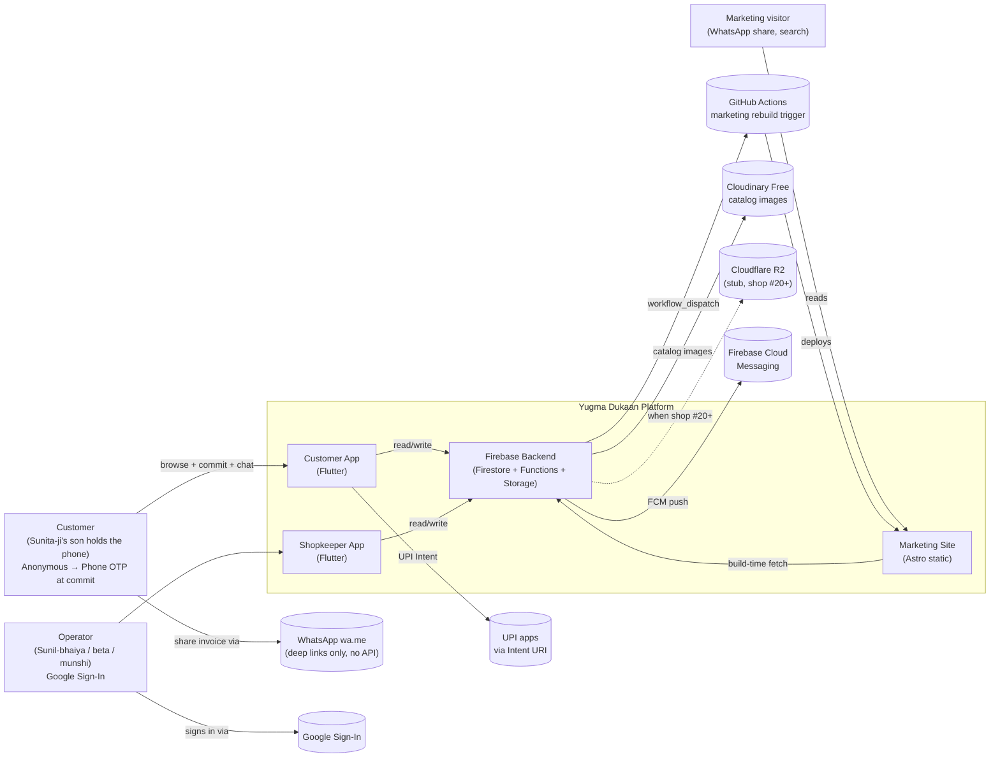

**External dependencies (every paid surface)**:

| External | Cost posture | Failure mode | Mitigation |
|---|---|---|---|
| Firebase Auth Phone OTP | Free up to 10k SMS/mo | Quota exhausted → cannot OTP-at-commit | `AuthProvider` adapter swaps to MSG91 / email / UPI-only |
| Firestore reads/writes | 50k reads / 20k writes / 1GB free per day | Quota exhausted | Read budget ≤30/session; kill-switch CF flips `firestoreWritesBlocked` |
| Cloud Functions invocations | 2M free per month | First to break is `triggerMarketingRebuild` | Debounce + `mediaCostMonitor` |
| Cloudinary | 25 credits/mo free | Breaks at shop #5–7 (FIRST ceiling) | `mediaCostMonitor` flips `media_store_strategy → r2` |
| Firebase Storage | 5GB free | Breaks at shop #25 | Same flag + R2 stub |
| Google Sign-In | Free | n/a | n/a |
| WhatsApp wa.me | Free | Policy change | `CommsChannel` adapter swaps to `firestore` |
| FCM push | Free | n/a | n/a |
| Cloudflare R2 | Stub only — not yet bound | n/a | Adapter binding deferred to shop #20 |

**There are no paid SaaS dependencies in v1.** This is operational discipline, not a moat (per Brief §4.7).

---

## 4. Container architecture (C4-L2)

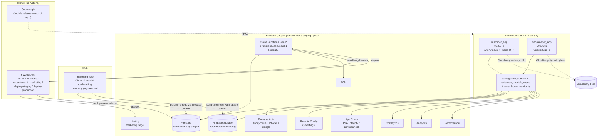

**Container responsibilities** (1 line each):

- `customer_app` — wedding family browse → DC → chat → commit (OTP) → pay (UPI) → invoice (PDF) → udhaar (read-only).
- `shopkeeper_app` — Sunil-bhaiya / beta / munshi: inventory, golden-hour capture, curation, chat reply, orders triage, udhaar entry, settings/branding, NPS/burnout, deactivation.
- `lib_core` — every model, repo, adapter, theme token, locale string, observability bootstrap, feature-flag plumbing, PDF invoice template, UPI intent builder. **Apps depend on lib_core; lib_core depends on nothing app-specific.**
- `marketing_site` — Astro static landing per shop, build-time content fetch via firebase-admin, voice greeting playback, deployed to Firebase Hosting target `marketing`.
- `Cloud Functions` — 9 Gen-2 TS functions in `asia-south1`: kill-switch, marketing rebuild, udhaar reminder, deactivation sweep, phone-auth quota monitor, multi-tenant audit, DC join, media cost monitor, wa.me link generator.
- `GitHub Actions` — 4 CI pipelines + 2 deploy pipelines (see §10).
- `Codemagic` — mobile APK release pipeline; **not in this repo** (per SAD §1).

---

## 5. Component architecture (C4-L3)

### 5.1 `packages/lib_core` — the shared core

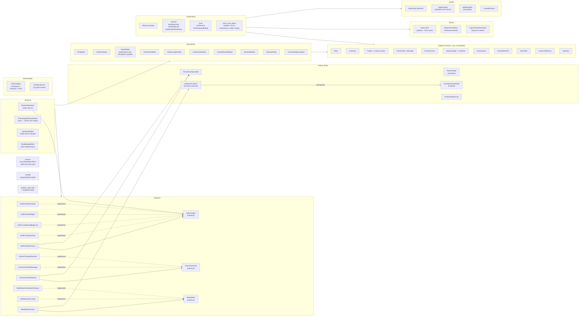

**Layering rule**: app code (`apps/customer_app`, `apps/shopkeeper_app`) imports from `lib_core` only. `lib_core` imports neither app. Every Firestore path is hidden behind a Repo. Every external system is hidden behind an Adapter. Every observability call goes through `Observability.*`. **No direct `FirebaseAuth.instance` / `FirebaseFirestore.instance` calls in app code.**

### 5.2 `apps/customer_app`

Feature-first layout under `lib/features/`:

| Feature | Owns | Key controllers (Riverpod) |
|---|---|---|
| `onboarding/` | B1.1 anon auth + Shop fetch + theme + locale | `onboardingControllerProvider` (`AsyncNotifier<OnboardingState>`) |
| `browse/` | B1.4/B1.5 shortlists + SKU detail | `curatedShortlistsPreviewProvider`, `shortlistSkusProvider`, `skuByIdProvider` |
| `chat/` | P2.4/P2.5 chat (text + voice), read tracking | `chatControllerProvider`, `voicePlaybackControllerProvider` (just_audio), `readTrackingControllerProvider` |
| `pariwar/` | P2.x persona toggle, Elder Tier, large-text | `personaProvider`, `isElderTierProvider`, `largeTextProvider` |
| `project/` | C3.1 draft → C3.4 commit (OTP) → C3.5 UPI payment | `draftControllerProvider`, `commitControllerProvider`, `paymentControllerProvider` |
| `orders/` | C3.10 timeline, share PDF (B1.13) | `customerProjectDetailProvider` (with `customerUid` guard, CR F5) |
| `udhaar/` | B-5 read-only ledger view | `_customerUdhaarLedgersProvider` |
| `shop/` | deactivation banner (C3.12), presence banner | `_shopPresenceProvider` |

Bootstrap order in `apps/customer_app/lib/main.dart` (load-bearing — do not reorder):
1. `_configureLogging()`
2. `runZonedGuarded` opens
3. `WidgetsFlutterBinding.ensureInitialized()` (Flutter ≥3.24 zone-sharing requirement)
4. `FirebaseClient.initialize()` — adds App Check
5. `RemoteConfigLoader.initialize()`
6. `AuthProviderFactory.build({remoteConfig, firebaseAuth})`
7. `Observability.initialize()` — `FlutterError.onError` + `PlatformDispatcher.instance.onError` + Isolate listener
8. `SessionBootstrap.verifyPersistedUser(...)` — silent sign-in (PRD I6.3)
9. `runApp(ProviderScope(overrides: [shopIdProviderProvider, authProviderInstanceProvider], child: CustomerApp()))`
10. Zone error handler → `Observability.crashlytics.recordError(..., fatal: true)`

### 5.3 `apps/shopkeeper_app`

Feature-first layout. Auth-gated router (vs onboarding-gated for customer):

| Feature | Owns |
|---|---|
| `auth/` | S4.1 Google Sign-In + S4.2 multi-operator (`OpsAuthController`, `RoleGate`, `BhaiyaOnlyGate`) |
| `dashboard/` | S4.13 home + "Aaj ka kaam", S4.16 media-spend tile, S4.17 NPS + burnout, S4.11 analytics |
| `inventory/` | S4.3 list / S4.4 edit / S4.5 Golden Hour capture (`image_picker`) |
| `curation/` | B1.12 drag-reorder shortlists |
| `orders/` | S4.6 active projects / S4.7 detail |
| `chat/` | S4.8 reply (text + voice) |
| `udhaar/` | S4.10 ledger with RBI guardrails |
| `voice/` | B1.6/B1.7 voice recorder (`record`), B1.8 greeting management |
| `presence/` | B1.9 absence-as-presence toggle |
| `settings/` | S4.12 branding + S4.19 3-tap deactivation |

The shopkeeper app has a singleton `mediaStoreProvider` in main.dart (not yet present in customer_app — gap). Theme is currently a Sprint 3 hardcoded placeholder via `ShopThemeTokens.sunilTradingCompanyDefault()`; customer_app already loads from Firestore — see §15.2.

### 5.4 `apps/marketing_site`

Astro 4.x static. Two pages: `index.astro` (full landing — hero / trust / catalog by occasion / about / CTA / footer; voice greeting playback live) and `visit.astro` (M5.4 contact + map). One layout (`BaseLayout.astro`) with all design tokens inlined. Build-time content fetch via `src/lib/fetch_shop_content.ts` (firebase-admin SDK, dynamically imported so it doesn't enter the static bundle). Hosted at `sunil-trading-company.yugmalabs.ai` via Firebase Hosting target `marketing`.

### 5.5 `functions/` — Cloud Functions Gen 2

9 functions, all `asia-south1`, all `256MiB`, all Node 22. See §7.1 inventory.

---

## 6. Data architecture

### 6.1 Firestore collection tree

```
/operators/{uid}                                 self-read map; created by Cloud Fn only
/system/{docId}                                  bhaiya read-only; Admin SDK writes
  ├── budget_alerts/history/{auto}
  ├── udhaar_reminders/history/{auto}
  ├── decision_circle_joins/history/{auto}
  ├── deactivation_sweeps/history/{auto}        ← drift: SAD says system/dpdp_purge_audit
  ├── media_cost_checks/history/{auto}
  ├── audit_results/{YYYY-MM-DD}/summary
  ├── phone_auth_quota/{YYYY-MM}/checks/history/{auto}
  ├── marketing_builds                           debounce doc
  ├── media_usage_counter/shops/{shopId}
  └── synthetic_shop_0_check                     sentinel

/shops/{shopId}                                  read: signed-in; create/delete: Admin SDK only
  ├── theme/{docId}                              including 'current'
  ├── themeTokens/{tokenDocId}                   ← drift: marketing reads `theme/current` instead
  ├── featureFlags/{flagId}                      including 'runtime' (kill-switch flags)
  ├── operators/{operatorUid}                    bhaiya-only writes
  ├── inventory/{skuId}                          soft-delete only
  ├── voiceNotes/{voiceNoteId}                   append-only
  ├── curatedShortlists/{shortlistId}            soft-delete only
  ├── udhaarLedger/{ledgerId}                    forbidden-vocab guarded
  ├── feedback/{feedbackId}                      create-only
  ├── projects/{projectId}                       state-machine guarded
  ├── chatThreads/{threadId}/messages/{msgId}    immutable except readByUids
  ├── customers/{customerId}
  ├── customer_memory/{uid}                      operator-only (private)
  ├── decision_circles/{dcId}                    ← drift: function writes `decisionCircle/{uid}`
  ├── golden_hour_photos/{photoId}
  ├── telemetry/{docId}                          operator-only
  └── today_tasks/{taskId}                       operator-only
```

**`/users/{uid}` is referenced in the SAD but does not exist** in `firestore.rules`. Either the SAD is stale or there is an unaddressed gap (drift item §15.2.J).

### 6.2 ER diagram

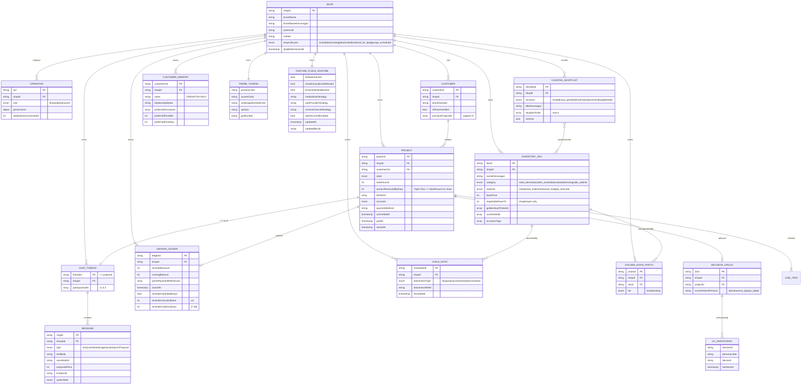

### 6.3 Indexes (`firestore.indexes.json` — 6 composites)

| # | Collection | Fields | Supports |
|---|---|---|---|
| 1 | `projects` | `customerUid ASC, updatedAt DESC` | "My recent projects" customer view |
| 2 | `projects` | `customerUid ASC, state ASC, createdAt DESC` | Customer projects filtered by state |
| 3 | `projects` | `state ASC, updatedAt DESC` | Operator dashboard ("all open committed") |
| 4 | `voiceNotes` | `attachmentType ASC, attachmentRefId ASC, recordedAt DESC` | Voice notes for SKU/message attachment |
| 5 | `udhaarLedger` | `reminderOptInByBhaiya ASC, closedAt ASC` | `sendUdhaarReminder` query |
| 6 | `udhaarLedger` | `closedAt ASC, runningBalance DESC` | "Open ledgers by balance" |

All are `COLLECTION` scope (not `COLLECTION_GROUP`), so multi-tenant isolation is implicit via the parent path. **If anyone adds a `collectionGroup('projects')` query (e.g., admin dashboard across shops), a `shopId`-leading composite is required.**

### 6.4 Security rules — the executable schema

`firestore.rules` is the executable schema. It enforces (in addition to per-collection field allowlists):

**Helper functions** (`firestore.rules:20–123`):
- `isSignedIn`, `isAnonymous`, `isPhoneVerified`, `isGoogleSignedIn` (provider distinction via `request.auth.token.firebase.sign_in_provider`)
- `callerShopId`, `callerRole` (custom claim readers)
- `isShopMember`, `isShopOperator`, `isOperatorOf`, `isCustomerOf`
- `hasShopId`, `shopIdMatches` (write-time tenant pinning)
- `shopIsWritable(shopId)` (lifecycle freeze — see below)
- `isValidProjectStateTransition(fromState, toState)` (state machine inside rule)
- `hasForbiddenUdhaarFields(data)` (RBI-defensive vocabulary block)

**Forbidden vocabulary block** (lines 112–123, applied at lines 289–307):
```
function hasForbiddenUdhaarFields(data) {
  return data.keys().hasAny(['interest','interestRate','overdueFee',
    'dueDate','lendingTerms','borrowerObligation','defaultStatus',
    'collectionAttempt']);
}
```

**Shop lifecycle gate** (lines 85–88):
```
function shopIsWritable(shopId) {
  return exists(/databases/$(database)/documents/shops/$(shopId))
      && get(/databases/$(database)/documents/shops/$(shopId)).data.shopLifecycle == 'active';
}
```
ANDed onto every mutation block. **Drift**: rules check only `== 'active'`, but the function `shop_deactivation_sweep.ts` uses `deactivating | purgeScheduled | purged`, while the SAD uses `active | deactivating | deactivated | retained_for_dpdp | purge_scheduled`. The freeze still triggers correctly because anything not `'active'` is non-writable, but vocabulary is fragmented across three sources.

**The Triple Zero invariant is NOT enforced at the rule layer.** The string `amountReceivedByShop` only appears in the customer-update field allowlist (line 424); there is no `==` predicate against `totalAmount`. A REST client bypassing the typed Dart patches could close a project with mismatched values. The invariant lives only in the Dart shape test (`cross_tenant_integrity_test.dart:145–169`). See §15.1.B.

### 6.5 Storage layout

```
gs://yugma-dukaan-{env}.appspot.com/
  └── shops/{shopId}/
        ├── voice_notes/{noteId}            <10MB, audio/* (rule)
        └── branding/{filename}             <10MB, image/* (rule); public read for marketing build
```

### 6.6 Schema versioning

There is currently no migration framework. New fields are added optimistically (Firestore is schemaless) and old documents are tolerated by the Dart Freezed defaults. Field-renames must coordinate Firestore rule allowlist + Dart model + tests + audit script in a single PR. **Drift item §15.2.K — no schema-version stamp on documents.**

---

## 7. API surface

### 7.1 Cloud Functions inventory (9 — code, not 8 as SAD §7 claims)

All functions: gen 2, region `asia-south1`, runtime `nodejs22`, memory `256MiB`, retryCount `0`. Predeploy `npm run lint && npm run build`.

| # | Function | File | Trigger | Schedule | Secrets | Auth gate |
|---|---|---|---|---|---|---|
| 1 | `killSwitchOnBudgetAlert` | `kill_switch.ts` | Pub/Sub topic `budget-alerts` | n/a | none | Pub/Sub-internal |
| 2 | `triggerMarketingRebuild` | `trigger_marketing_rebuild.ts` | Firestore `onDocumentWritten` `shops/{shopId}/theme/current` | n/a | `GITHUB_PAT` | Admin |
| 3 | `sendUdhaarReminder` | `send_udhaar_reminder.ts` | Scheduler | `0 9 * * *` IST | none | n/a |
| 4 | `shopDeactivationSweep` | `shop_deactivation_sweep.ts` | Scheduler | `0 2 * * *` IST | none | n/a |
| 5 | `phoneAuthQuotaMonitor` | `phone_auth_quota_monitor.ts` | Scheduler | `0 10 * * *` IST | none | n/a |
| 6 | `multiTenantAudit` | `multi_tenant_audit.ts` | Scheduler | `0 3 * * 0` (Sun) IST | none | n/a |
| 7 | `joinDecisionCircle` | `join_decision_circle.ts` | HTTPS `onCall` | n/a | none | `request.auth` + token.shopId match + role check |
| 8 | `mediaCostMonitor` | `media_cost_monitor.ts` | Scheduler | `0 11 * * *` IST | none | n/a |
| 9 | `generateWaMeLink` | `generate_wa_me_link.ts` | HTTPS `onCall` | n/a | none | `request.auth` + token.shopId match |

**Five SAD-vs-code drifts in this section** (drift backlog §15.2.D):
- SAD says 8 functions; code ships 9 (`triggerMarketingRebuild` undocumented in SAD §7).
- SAD says `multiTenantAuditJob` runs *daily*; code runs *weekly Sunday*.
- SAD says `mediaCostMonitor` runs *every 6h*; code runs *daily 11:00*.
- SAD says `phoneAuthQuotaMonitor` runs *every 6h*; code runs *daily 10:00*.
- SAD says `shopDeactivationSweep` runs *03:00 IST*; code runs *02:00 IST*.

**App Check is not enforced on either Callable** (`joinDecisionCircle`, `generateWaMeLink`) — `firebase.json` has no App Check directive and `enforceAppCheck: true` is absent from the `onCall` options. The comment in `firestore.rules:71–73` claims App Check is enforced "at the Firebase product level" — false. See §15.1.C.

**ADR-009 v1.0.3 specified HMAC-SHA256 7-day join tokens for `joinDecisionCircle`. NOT IMPLEMENTED.** Grep for `HMAC|sha256|joinToken` returns zero hits. The function instead trusts caller-uid-or-operator-role directly. See §15.1.A.

### 7.2 Callable contracts (current — what code accepts, NOT what spec says)

```
joinDecisionCircle(input: { sourceUid: string, destUid: string, shopId: string })
  → guards: request.auth set; token.shopId == input.shopId; caller is sourceUid OR has role in {bhaiya,beta,munshi}
  → effect: writes /shops/{shopId}/decisionCircle/{destUid}, audits to /system/decision_circle_joins/history

generateWaMeLink(input: { shopId: string, projectId?: string, payload?: object })
  → guards: request.auth set; token.shopId == input.shopId
  → effect: returns Uri for wa.me with prefilled Hindi message + signed shop content blob
```

### 7.3 Scheduled jobs cadence (cross-checked against code)

| Job | Cron | Purpose |
|---|---|---|
| `sendUdhaarReminder` | `0 9 * * *` IST | Daily FCM reminder for opted-in udhaar; cap 3 lifetime, cadence [7,30] days |
| `shopDeactivationSweep` | `0 2 * * *` IST | DPDP state machine: `deactivating → purgeScheduled` (24h grace), `purgeScheduled → purged` (180-day retention; PII anonymization on 7 fields) |
| `phoneAuthQuotaMonitor` | `0 10 * * *` IST | Reads `system/phone_auth_quota` SMS counter; flips MSG91 fallback at 80%, OTP-disable at 95% |
| `mediaCostMonitor` | `0 11 * * *` IST | Reads `system/media_usage_counter`; flips `cloudinaryUploadsBlocked` at 100% |
| `multiTenantAudit` | `0 3 * * 0` IST (weekly Sun) | Cross-tenant integrity sweep; samples 100 docs each across 9 subcollections; flags `shopId_mismatch`, `shop_0_missing`, `shop_0_mutated` to `system/audit_results/{date}/summary` |

### 7.4 External integrations

| Surface | Endpoint | Credentials |
|---|---|---|
| `triggerMarketingRebuild` → GitHub Actions | `POST https://api.github.com/repos/aloktiwarigit/sunil_trading_comp/actions/workflows/ci-marketing.yml/dispatches` | `GITHUB_PAT` via Firebase Secret Manager |
| `sendUdhaarReminder` → FCM | `admin.messaging().send(...)` | Default service account |
| (incoming) Cloud Billing → `killSwitchOnBudgetAlert` | Pub/Sub topic `budget-alerts` | n/a |

**Hardcoded GitHub coords** (`trigger_marketing_rebuild.ts:39–40` — `aloktiwarigit/sunil_trading_comp`) should move to a Functions config param to support per-environment GitHub repos. See §15.2.E.

---

## 8. Critical flows

### 8.1 First-time customer onboarding (B1.1 — the 30-second test)

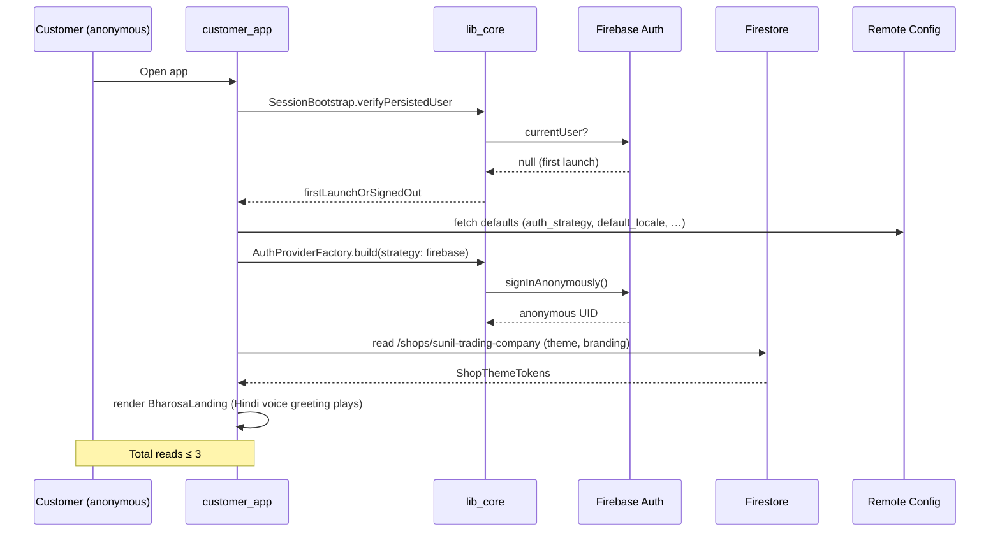

### 8.2 OTP-at-commit (C3.4) and silent restore on next launch

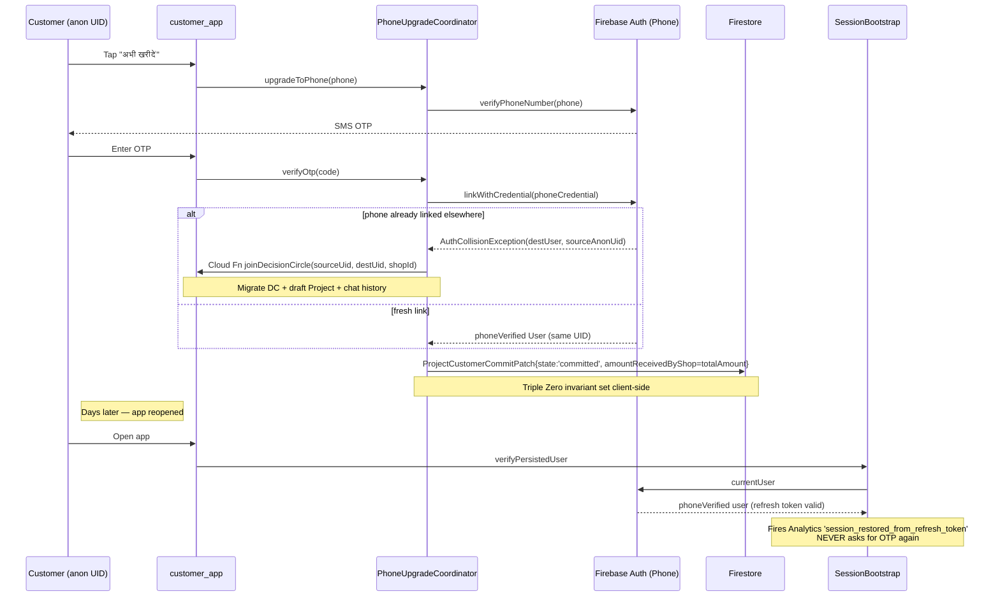

### 8.3 Decision Circle handoff via wa.me (P2 — multi-device join)

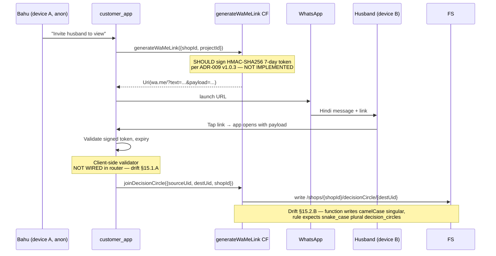

### 8.4 Theme hot-reload (B1.12 — bhaiya edits brand color in Settings)

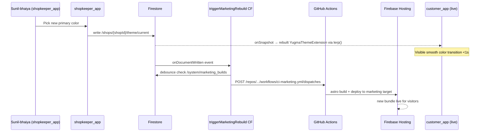

### 8.5 Kill-switch propagation (ADR-007 v1.0.4)

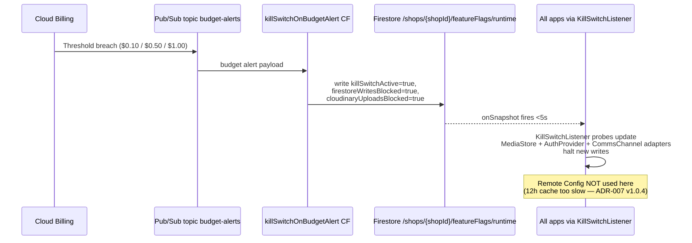

### 8.6 MediaStore Cloudinary→R2 swap (ADR-014)

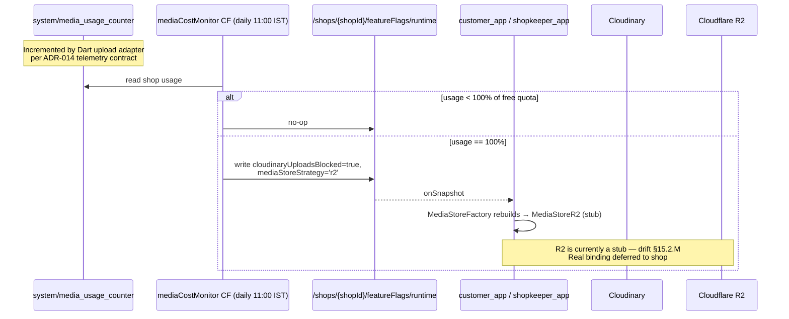

### 8.7 Shop deactivation sweep (DPDP — ADR-013)

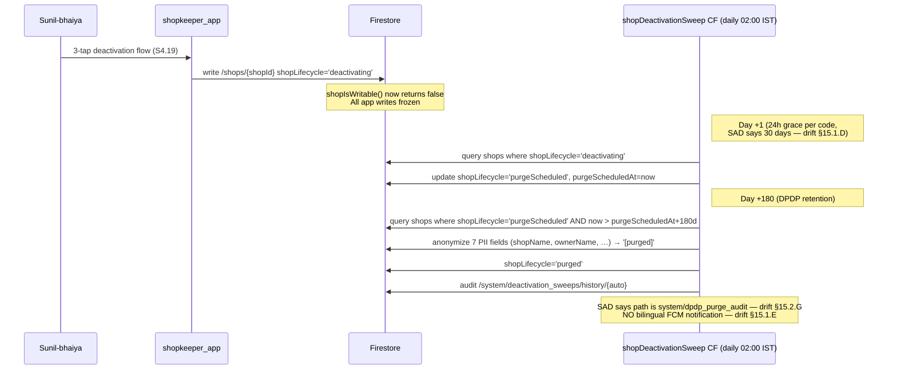

### 8.8 Udhaar reminder cycle (S4.10 + ADR-010 RBI guardrails)

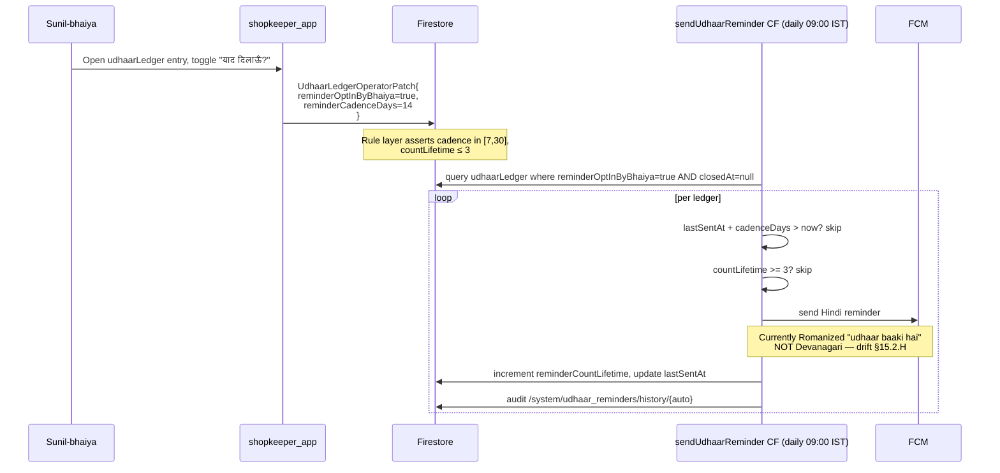

### 8.9 Marketing site rebuild

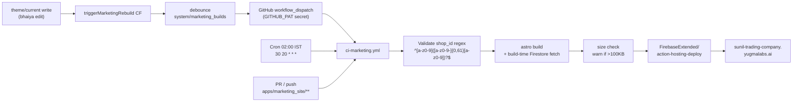

### 8.10 Project state machine

```mermaid
stateDiagram-v2
    [*] --> draft: Customer adds first SKU
    draft --> draft: edit lineItems
    draft --> negotiating: Customer / bhaiya msg
    negotiating --> committed: C3.4 commit + Phone OTP
    committed --> paid: C3.5 UPI / COD / bank / udhaar
    paid --> delivering: bhaiya marks dispatched
    delivering --> closed: Customer confirms delivery
    delivering --> awaitingVerification: udhaar partial pay
    awaitingVerification --> closed
    draft --> cancelled: ProjectCustomerCancelPatch (only this transition allowed for customer)
    negotiating --> cancelled: bhaiya
    committed --> cancelled: bhaiya only
    
    note right of committed: Triple Zero set:<br/>amountReceivedByShop = totalAmount<br/>(client-only — not in rules — §15.1.B)
```

### 8.11 Shop lifecycle

```mermaid
stateDiagram-v2
    [*] --> active: Shop created
    active --> deactivating: bhaiya 3-tap deactivation (S4.19)
    deactivating --> purgeScheduled: sweep CF, +24h grace
    purgeScheduled --> purged: sweep CF, +180d retention, PII anonymized
    purged --> [*]
    
    note right of active: shopIsWritable() == true<br/>(only state where writes allowed)
    note left of deactivating: SAD vocabulary differs:<br/>active|deactivating|deactivated|<br/>retained_for_dpdp|purge_scheduled<br/>(drift §15.2.F)
```

---

## 9. Cross-cutting concerns

### 9.1 Authentication & authorization

**Three-tier model** (ADR-002):

| Tier | Provider | Used by | Persistence |
|---|---|---|---|
| 0 — Anonymous | Firebase Anonymous | Customer browse + DC | Refresh token |
| 1 — Phone | Firebase Phone OTP | Customer commit | Refresh token; **silent sign-in forever** after one OTP per install |
| 2 — Google | Google Sign-In | Shopkeeper ops | Google session |

**Custom claims** issued by the `signupNewOperator` Cloud Function — **which does not exist yet**. Operators are seeded manually via Firebase Auth console; this is a v1 ops gap (§15.2.L).

**Anonymous → Phone UID merger (I6.2)** — `PhoneUpgradeCoordinator` orchestrates `linkWithCredential`. If the phone is already linked elsewhere (`AuthCollisionException`), DC + draft Project + chat history migrate to the destination UID via `joinDecisionCircle` Cloud Function. `AppUser` (the framework-neutral wrapper) **never exposes `firebase_auth.User`** — preserves adapter swap option.

**Crashlytics user identifier** is the UID, never the phone (DPDP minimization at `session_bootstrap.dart:135`).

### 9.2 Multi-tenancy isolation — the crown jewel

The cross-tenant integrity test runs on **every PR with no path filter** (`ci-cross-tenant-test.yml` — ADR-012). It is the only workflow with this property. Three jobs:

1. **TS rules test** (`tools/src/cross_tenant_integrity.test.ts`) against Firebase emulator with the real `firestore.rules` loaded. Asserts `shop_1` operator cannot read/write across to `shop_0` (4 collection types each), all 8 forbidden udhaar fields rejected, default-deny verified, lifecycle freeze verified across `deactivating|purge_scheduled|purged`, feedback partition verified.
2. **Dart shape test** (`packages/lib_core/test/cross_tenant_integrity_test.dart`) against `FakeFirebaseFirestore`. Asserts every model carries `shopId`, `Shop.isWritable` only `'active'`, `Project.zeroCommissionSatisfied` invariant, the 3 patch classes emit only their owned fields, RBI guardrails on UdhaarLedger.
3. **`tools/audit_project_patch_imports.sh`** asserts customer_app imports nothing that constructs operator/system patches (Standing Rule 11).

**Synthetic shop_0 seeder (`tools/src/seed_synthetic_shop_0.ts`) is NOT invoked in CI** — the TS test uses inline `beforeEach` seeding instead. Two seed paths exist; refactor deferred (drift §15.3.A).

**`multiTenantAudit` Cloud Function** runs weekly Sunday 03:00 IST and flags `shopId_mismatch | shop_0_missing | shop_0_mutated` to `system/audit_results/{date}/summary`. **No paging — just dashboard signal.**

### 9.3 Feature flags (Remote Config + Firestore real-time)

Per ADR-007 v1.0.4, flags are split across two stores:

**Remote Config (slow-changing, cosmetic — 12h cache acceptable):**
`auth_provider_strategy`, `comms_channel_strategy`, `media_store_strategy`, `default_locale`, `decision_circle_enabled`, `otp_at_commit_enabled`, `in_app_chat_enabled`, `elder_tier_enabled`, `golden_hour_photo_enabled`, `join_decision_circle_enabled`, `kill_switch_active`, `cloudinary_uploads_blocked`, `firestore_writes_blocked`, `cloudinary_cloud_name`. Defaults registered in `RemoteConfigLoader._defaults`; refresh `minimumFetchInterval: 1h`, `fetchTimeout: 10s`.

**Firestore real-time at `/shops/{shopId}/featureFlags/runtime` (billable / safety-critical — <5s propagation):**
`killSwitchActive`, `cloudinaryUploadsBlocked`, `firestoreWritesBlocked`, `authProviderStrategy`, `commsChannelStrategy`, `mediaStoreStrategy`, `otpAtCommitEnabled`, plus `updatedAt` and `updatedByUid` for audit. Watched by `KillSwitchListener` via `onSnapshot` with documented fail-open-on-transient-error posture.

**Two flags are duplicated across both stores** (`commsChannelStrategy`, `otpAtCommitEnabled`) without codified precedence. **`guest_mode_enabled` is consumed at `apps/customer_app/lib/features/pariwar/persona_toggle.dart:131,297` but is NOT declared in the canonical `FeatureFlags` constants registry** — easy to typo (drift §15.2.I).

### 9.4 Observability

**Stack: Firebase suite only.** Sentry, OpenTelemetry, PostHog, GrowthBook are all absent (the agency-floor stack is not present here — and is not appropriate for the free-features-only constraint anyway).

`Observability.initialize()` in `lib_core/observability/observability.dart` wires:
- Crashlytics: `FlutterError.onError`, `PlatformDispatcher.instance.onError`, background `Isolate.current.addErrorListener`
- Performance + Analytics + Crashlytics collection toggled OFF in `kDebugMode`
- Idempotent — safe to call multiple times

**12 typed Analytics events** (`analytics_events.dart`):
1. `auth_anonymous_signed_in`
2. `auth_phone_otp_requested`
3. `auth_phone_verified`
4. `project_created`
5. `project_committed`
6. `decision_circle_persona_switched`
7. `voice_note_recorded`
8. `udhaar_recorded`
9. `feature_flag_swap_triggered`
10. `session_restored_from_refresh_token`
11. `read_budget_warning`
12. `read_budget_exceeded`

**Cloud Functions logging**: `firebase-functions/v2 logger.{info,warn,error}` with structured field bags (e.g., `{shopId, ledgerId, error}`). No traceId / requestId correlator field convention yet (drift §15.3.B).

### 9.5 i18n / localization

**Hindi is source-of-truth** (ADR-008). `strings_hi.dart` is canonical; `strings_en.dart` is a derived translation. There is no `intl` ARB file system — by deliberate choice (header in `strings_base.dart` says "no ICU MessageFormat, no intl_utils code generation"). Strings are pure Dart const classes for compile-time safety + Devanagari readability in source.

`LocaleResolver.resolve({remoteConfig, userOverride})` precedence: `userOverride > remoteConfig.default_locale > 'hi'`. User toggle persists in `shared_preferences`. Unknown locale → fallback to `hi` with Crashlytics warning.

**Cloud Function copy is currently Romanized Hindi only** (e.g., `send_udhaar_reminder.ts:139` says `"... se aapka udhaar baaki hai..."`). Not Devanagari, not bilingual. The DPDP-mandated bilingual deactivation FCM is NOT implemented — drift §15.1.E and §15.2.H.

### 9.6 Accessibility

**Two tiers** per UX Spec §7:
- **Default** — WCAG AA (4.5:1 body, 3:1 large), 48dp tap targets, 200ms animations.
- **Elder** — WCAG AAA (7:1 body, 4.5:1 large), 56dp tap targets, 300ms, ×1.4 text size, ×1.3 voice volume, label-only bottom nav. Toggled by `isElderTierProvider` derived from persona.

**MediaQuery.textScaler is not consumed anywhere** — the Elder Tier flag flips a bool but no actual scaling override path exists yet (drift §15.2.O).

**5-device QA matrix** (Realme C21, Redmi 9, Tecno Spark 9T, Samsung Galaxy M04, Lava Blaze 2 5G) is **paper only** — no Firebase Test Lab / Codemagic device-matrix step in any workflow. The matrix is referenced in 6 docs and never invoked in CI (drift §15.2.N).

**No axe-core / Pa11y / Lighthouse a11y in CI** for the marketing site (drift §15.3.C).

### 9.7 Offline & resilience

Firestore offline persistence is enabled by default on mobile SDKs; **no explicit `Settings(persistenceEnabled: true)` or `cacheSizeBytes`** is set anywhere — relying on default. Conflict resolution is **last-write-wins per partition** because field-partition discipline (Standing Rule 11) ensures customer/operator/system writes target disjoint field sets.

Marketing site is Astro static — no service worker (per ADR-011, the ≤50KB Tier-3 3G target rules out service worker bloat).

`KillSwitchListener` documents fail-open-on-transient-error explicitly — if onSnapshot errors transiently, the cached snapshot stays in effect and the user is not blocked.

### 9.8 Performance & cost budgets

**Read budget (Truth #3) — instrumented but no dev overlay.** `ReadBudgetMeter` (`lib_core/services/read_budget_meter.dart`) — `maxReads=30`, `warningThreshold=25`. Throws `ReadBudgetExceededException` on overrun, fires `read_budget_warning` / `read_budget_exceeded` events. Currently consumed only by `ProjectRepo`. Drift §15.3.D — no in-app counter visible to devs.

**Cost ceilings** (per SAD §10):

| Shop count | Monthly cost | First ceiling broken |
|---|---|---|
| #1 | ₹0 | — |
| #5 | ₹0 | — |
| #5–7 | ~₹0–350 | **Cloudinary** (FIRST, not phone auth as Brief assumed) |
| #10 | ~₹350 | |
| #20 | ~₹1,050 | |
| #25 | ~₹1,400 | Cloud Storage |
| #33 | ~₹2,050 | Phone-auth SMS quota |
| #50 | ~₹6,500–8,000 | Compound |

**Performance targets:**
- Customer-app cold start <3s on 5-device matrix.
- Marketing site <1s on Tier-3 3G; SAD target ≤50KB initial paint (CI gate is 100KB warn-only — 2× over target).
- Theme hot-reload <1s via Firestore real-time.
- Kill-switch flag propagation <5s via Firestore real-time (NOT Remote Config 12h cache).
- Devanagari subset payload ≤100KB Devanagari pair + ≤60KB English pair.

**Marketing site loads fonts via Google Fonts CDN** (`BaseLayout.astro:28-31`) — not the subset output from `tools/generate_devanagari_subset.sh`. The subset script exists but its output is unused on the marketing path (drift §15.2.P). Tier-3 3G target is unmet on first visit.

### 9.9 Forbidden vocabulary discipline

Three enforcement layers:

1. **Firestore rule** — `hasForbiddenUdhaarFields()` rejects 8 English field names on `udhaarLedger` create + update (lines 112–123, 289–307).
2. **TS rules test** asserts every forbidden field is rejected (`cross_tenant_integrity.test.ts:240–289`) on every PR.
3. **String-locale test** verifies Hindi forbidden vocabulary absence in `strings_hi.dart` (the file itself documents this at lines 25–27).

**There is no Dart-source CI grep for forbidden English field names.** A new model field could be added in Dart with a forbidden name; it would compile and the rule would reject it only at runtime. Drift §15.3.E — add a CI grep step.

**Mythic vocabulary** (UX Spec §5.6 "show, don't sutra"): banned in copy — `शुभ`, `मंदिर`, `धर्म`, `तीर्थ`, `आशीर्वाद`, `पूज्य`, `मंगल`, `स्वागतम्`, `उत्पाद`, `गुणवत्ता`, `श्रेष्ठ`. Use `स्वागत` (not `स्वागतम्`).

**`dahej` removal**: ✅ resolved per §15.1.G. `PreferredOccasion.dahej` is now `betiKaGhar`, all 4 broken test files are green, and codegen has been refreshed. Only intentional historical reference remains in `strings_base.dart` (a comment marking the rename).

### 9.10 Field-partition discipline (Standing Rule 11 / I6.12 — the unusually rigorous part)

The codebase uses **three deliberately-distinct (NOT sealed-union) Freezed classes** per partitioned entity:

- `ProjectCustomerPatch` — customer_app only — `occasion`, `unreadCountForCustomer`
- `ProjectCustomerCancelPatch` — customer_app only — `draft → cancelled` only
- `ProjectCustomerCommitPatch` — customer_app only — sets `state='committed'` and Triple Zero invariant
- `ProjectOperatorPatch` — shopkeeper_app only — `state`, `totalAmount`, `amountReceivedByShop`, `lineItems`, etc.
- `ProjectOperatorRevertPatch` — shopkeeper_app only — limited revert
- `ProjectSystemPatch` — Cloud Functions only — `lastMessagePreview`, `lastMessageAt`, `updatedAt`

`ChatThread` and `UdhaarLedger` follow the same pattern. Enforcement is **four-layer**:
1. Dart import graph — apps import patches with `show ProjectCustomerPatch;` to keep operator types out of scope
2. `tools/audit_project_patch_imports.sh` CI script
3. **Negative-compilation tests** at `packages/lib_core/test/fails_to_compile/` — three files that *must fail* `dart analyze --fatal-infos --fatal-warnings`. CI runs analyzer; if these compile, build breaks.
4. Repository pattern — `ProjectRepo` has NO generic `update`, only typed patch methods (`applyCustomerPatch`, `applyOperatorPatch`, `applySystemPatch`).

This is unusually rigorous and is the strongest single discipline in the codebase. Maintain it religiously.

---

## 10. DevOps & deployment

### 10.1 Environments

| Alias | Project ID | Hosting target | Purpose |
|---|---|---|---|
| `default` / `dev` | `yugma-dukaan-dev` | `marketing` bound | Live development; flagship runs here today |
| `staging` | `yugma-dukaan-staging` | `marketing` bound (resolved §15.1.F) | Pre-prod soak |
| `prod` / `production` | `yugma-dukaan-prod` | `marketing` bound (resolved §15.1.F) | Production. Both aliases coexist — `deploy-production.yml` uses `production`; CLI users / the architecture doc historically said `prod`. |

### 10.2 CI pipelines (6 — README says 5, drift §15.3.F)

| Pipeline | File | Trigger | Gates | Deploy |
|---|---|---|---|---|
| Flutter CI | `ci-flutter.yml` | PR + push (paths: `apps/**`, `packages/**`, `melos.yaml`, `analysis_options.yaml`) | melos bootstrap → build_runner → analyze → format check → test → smoke build customer + shopkeeper APK debug | none |
| Cloud Functions CI | `ci-cloud-functions.yml` | PR + push (paths: `functions/**`) | npm ci → lint → build → test (`--if-present`) | none |
| **Cross-tenant integrity** | `ci-cross-tenant-test.yml` | **EVERY PR + push to main, no path filter** (ADR-012) | TS rules test (emulator) + Dart shape test + `audit_project_patch_imports.sh` | none — gate only |
| Marketing CI | `ci-marketing.yml` | PR + push (paths: `apps/marketing_site/**`); `workflow_dispatch` from `triggerMarketingRebuild`; cron `30 20 * * *` (02:00 IST) | shop_id regex validation → astro build → bundle size warn (>100KB) → upload artifact → deploy | Hosting target `marketing`, project `yugma-dukaan-dev`, channel `live` |
| Deploy staging | `deploy-staging.yml` | `workflow_dispatch` + push to main (paths: rules, indexes, storage, functions, marketing) | env protection: `staging` | rules + indexes + storage + functions + hosting:marketing → `staging` |
| Deploy production | `deploy-production.yml` | `workflow_dispatch` only; first step rejects unless `confirm == "DEPLOY"` | env protection: `production` + DEPLOY string | same scope → `production` |

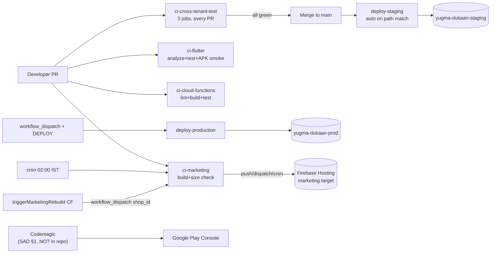

**Mobile app deploys are not in this repo.** Customer/shopkeeper APK release goes through Codemagic per SAD §1.

### 10.3 Secrets management

| Secret | Used in | Purpose |
|---|---|---|
| `FIREBASE_SERVICE_ACCOUNT` | `ci-marketing.yml` | Hosting deploy SA |
| `FIREBASE_MARKETING_READONLY_SA_JSON` | `ci-marketing.yml` + `fetch_shop_content.ts` | Read-only build-time Firestore SA |
| `FIREBASE_STAGING_SA_KEY` | `deploy-staging.yml` | Staging SA |
| `FIREBASE_PRODUCTION_SA_KEY` | `deploy-production.yml` | Prod SA |
| `GITHUB_TOKEN` | `ci-marketing.yml` | PR preview channel comments |
| `GITHUB_PAT` | `triggerMarketingRebuild` Cloud Fn (Secret Manager) | GitHub workflow_dispatch |

Staging + prod write SA JSON to `/tmp/sa-key.json` and `rm -f` it in `if: always()` cleanup steps — good hygiene. `.gitignore` excludes `.env`, `.env.*` (allows `.env.example`), `*.pem`, `serviceAccountKey*.json`. `google-services.json` and `GoogleService-Info.plist` ARE committed by design — security comes from App Check + Firestore rules, not key secrecy.

### 10.4 Codex review gate

**Per agency CLAUDE.md, Codex CLI is the authoritative cross-model review gate.** Wired in CI as `.github/workflows/codex-review-gate.yml` (resolved §15.2.Q). The workflow runs on every PR to `main` (no path filter), checks for the `.codex-review-passed` marker file, and verifies the marker was added or refreshed within this PR (anti-staleness — copying an old marker from `main` is caught). Contributors create the marker by running `codex review` (or invoking the `codex-review-gate` skill) locally before opening the PR.

**Branch protection step (manual, in GitHub UI):** Settings → Branches → Branch protection rules for `main` → Require status checks to pass → add `Codex review gate / verify-marker`. Without that, the workflow runs but doesn't block merge.

---

## 11. Testing strategy

### 11.1 The pyramid

| Layer | Count | Where |
|---|---|---|
| Unit | ~30 Dart files | `packages/lib_core/test/` (adapters, models, repos, locale, theme, services, components, fails_to_compile, observability smoke) |
| Widget | included above | `lib_core/test/components/`, `apps/customer_app/test/`, `apps/shopkeeper_app/test/` |
| Integration (rules — emulator) | 1 | `tools/src/cross_tenant_integrity.test.ts` (33+ assertions across 8 describe blocks) |
| Integration (Dart — fake) | 1 | `packages/lib_core/test/cross_tenant_integrity_test.dart` (21 assertions) |
| Negative-compilation | 3 | `packages/lib_core/test/fails_to_compile/` — must fail `dart analyze` |
| App-level Dart | 6 | 4 customer_app + 2 shopkeeper_app — light coverage |
| Cloud Functions | 2 of 9 | `functions/test/kill_switch.test.ts`, `trigger_marketing_rebuild.test.ts` only — drift §15.2.R |
| E2E (Playwright) | 0 | None — drift §15.3.G |
| Coverage gate | 0 | No Codecov, no `--coverage` flag, no 80% gate — drift §15.2.S |

### 11.2 The cross-tenant integrity test (THE gate)

The canonical PR-blocker. Three jobs:

1. **TS rules test** — full enumeration of cross-shop read denials (4 collection types × 2 directions), all 8 forbidden udhaar fields, default-deny, lifecycle freeze in `deactivating | purge_scheduled | purged`, feedback partition rules, customer-spoofing-authorUid denial.
2. **Dart shape test** — every model carries `shopId`; `Shop.isWritable` only `'active'`; `Project.zeroCommissionSatisfied` true at `25000/25000` and false at `24000/25000`; the 3 patch classes emit only their owned fields; UdhaarLedger reminder caps `[7,30]` and `≤3`; `ProjectRepo.applyCustomerPatch` writes only customer-owned fields.
3. **Patch import audit** — bash + grep ensures customer_app cannot reach operator patches and vice versa.

**This test must run on every PR no matter what changes.** It is the only workflow with no `paths:` filter.

### 11.3 Negative-compilation tests

`customer_app_constructs_operator_patch.dart` and 2 siblings at `packages/lib_core/test/fails_to_compile/` are intentionally broken — they import operator/system patch types from the customer app side. CI runs `dart analyze --fatal-infos --fatal-warnings`; if these files start compiling, the build breaks. This is the **last line of defense** for field-partition discipline.

---

## 12. Security & compliance

### 12.1 STRIDE-lite threat model

There is no `docs/threat-model.md`. Drift §15.3.H — author one. Pending that, headline threats:

| Threat (STRIDE) | Surface | Current mitigation | Gap |
|---|---|---|---|
| **Spoofing** auth identity | Callable Functions | `request.auth` + token claims | App Check NOT enforced — §15.1.C |
| **Tampering** udhaar fields | Firestore client write | Forbidden-field rule | No CI grep on Dart source — §15.3.E |
| **Tampering** Project.amountReceivedByShop | REST API | Dart typed-patch | NOT enforced in rule — §15.1.B |
| **Repudiation** of operator action | n/a | Cloud Function audit logs in `system/*/history` | Unbounded retention — §15.2.T |
| **Information disclosure** PII | Customer doc reads | Phone read scoped to operators | No encryption-at-rest beyond GCP default; no PII data flow diagram |
| **Information disclosure** cross-tenant | Firestore queries | Multi-tenant rules + cross-tenant test | `multiTenantAudit` violations don't page — §15.3.I |
| **Denial of service** budget exhaustion | Cloud Functions / Firestore | Kill-switch CF + budget alerts | Single-region (asia-south1); regional outage = full outage — §15.3.J |
| **Elevation of privilege** customer → operator | Custom claims | `request.auth.token.role` check | `signupNewOperator` CF doesn't exist — §15.2.L |
| **Elevation of privilege** DC join token forge | `joinDecisionCircle` | Caller-uid OR operator-role | HMAC token NOT implemented — §15.1.A |

### 12.2 RBI Digital Lending Guidelines posture (ADR-010)

- **Forbidden vocabulary** enforced in 3 layers (rules + TS test + Dart tests).
- **Reminder caps** enforced 3 layers: rule (`firestore.rules:298–307`), Dart patch (`UdhaarLedgerOperatorPatch` validator), Cloud Function (`send_udhaar_reminder.ts:170` increment-on-success).
- **Customer cannot self-create udhaar** — rule denies; only shopkeeper-initiated writes allowed.
- **No reminder on closed ledger** — query filters `closedAt == null`.

### 12.3 DPDP Act 2023 (ADR-013)

| Requirement | Code | Status |
|---|---|---|
| 180-day retention | `shop_deactivation_sweep.ts:34 DPDP_RETENTION_MS = 180 days` | ✅ |
| 30-day grace before retention starts | code is 24h (`GRACE_PERIOD_MS`); SAD/spec is 30 days | **❌ DRIFT §15.1.D** |
| PII anonymization on purge | 7 fields → `'[purged]'` (line 202–214) | ✅ |
| Audit log path | code: `system/deactivation_sweeps/history`; spec: `system/dpdp_purge_audit` | **❌ DRIFT §15.2.G** |
| Bilingual FCM notification on deactivation | NOT implemented — no `messaging().send()` in sweep CF | **❌ DRIFT §15.1.E** |
| Configurable retention per shop | not implemented | drift §15.3.K |
| Audit log retained beyond shop deletion | yes (system/* not in shop scope) | ✅ |

### 12.4 PII handling

- Phone numbers stored on Customer doc (E.164) and on Project (`customerPhone`).
- Crashlytics `setUserIdentifier(uid)` — UID only, never phone (DPDP-min).
- Voice notes encryption: Firebase default (Google-managed keys) — no customer-managed keys.
- Marketing site loads Google Fonts from `fonts.googleapis.com` — third-party request, no consent — drift §15.2.U.

### 12.5 App Check

Client-side `FirebaseAppCheck.activate(playIntegrity / deviceCheck)` in release; debug provider in debug. **Server-side enforcement on callables is now active** (resolved §15.1.C): both `joinDecisionCircle` and `generateWaMeLink` ship with `enforceAppCheck: true` in their onCall options — un-attested calls are rejected. Firestore + Storage App Check enforcement is configured in the Firebase Console (Project Settings → App Check), an ops step captured in `docs/runbook/staging-setup.md`.

### 12.6 Secrets posture

Single Firebase Secret Manager-bound credential: `GITHUB_PAT`. All GitHub Actions secrets listed in §10.3. **No secret-scanning CI step** (gitleaks / trufflehog) — drift §15.2.V. **No Dependabot, no CodeQL, no Semgrep, no Trivy, no SBOM, no SLSA** — agency enterprise floor unmet — drift §15.2.W.

---

## 13. Operations

### 13.1 Runbook inventory (`docs/runbook/`)

| Runbook | Covers |
|---|---|
| `font-subset-build.md` | Devanagari font subsetting build process (fonttools / brotli / zopfli prereqs + budget mapping) |
| `staging-setup.md` | Staging environment setup (Blaze upgrade, rule deploy, custom claims) |
| `hindi_design_capacity_verification.md` | Constraint 15 / I6.11 Sprint 0 gate |

**SAD §3 prescribed but missing**: `kill_switch_response.md`, `multi_tenant_breach_response.md`, `phone_quota_breach_response.md`. Each corresponds to a deployed Cloud Function. **A P0 incident on any of these has no playbook today** — drift §15.1.H.

### 13.2 Alerting

- Cloud Billing → Pub/Sub `budget-alerts` → `killSwitchOnBudgetAlert` CF (autonomous response).
- `multiTenantAudit` writes violations to `system/audit_results/{date}/summary` — **dashboard-only, no email/page/Slack** — drift §15.3.I.
- `phoneAuthQuotaMonitor` flips flags but does not page anyone.
- `notify-on-failure` job in `ci-marketing.yml` only logs to Actions console — no email/webhook — drift §15.3.L.

### 13.3 Disaster recovery

| Concern | Status |
|---|---|
| Firestore backup (`gcloud firestore export`) | **NOT FOUND** — drift §15.2.X |
| Cloud Functions rollback | Native (`firebase deploy --only functions:fn`) — not codified in runbook |
| Hosting rollback | Native (`firebase hosting:rollback`) — not codified |
| RTO / RPO targets | **NOT DOCUMENTED** — drift §15.3.M |
| Region | Single (asia-south1) — regional outage = full outage |
| Multi-region strategy | None |

### 13.4 Cost monitoring

- Cloud Billing budget at $1/mo with alerts at $0.10 / $0.50 / $1.00 (ADR-001 / ADR-007).
- `mediaCostMonitor` daily 11:00 IST.
- `phoneAuthQuotaMonitor` daily 10:00 IST.
- **`tools/cost_forecaster*` referenced in README does NOT exist** — drift §15.3.N.

---

## 14. ADR index (all 15)

ADRs live as sections inside `_bmad-output/planning-artifacts/solution-architecture.md` §11 (lines 2762–2962). The agency-template form `docs/adr/0001-*.md` is **not** present and is not required for this project per SAD §11.

| # | Title | Status | Decision summary |
|---|---|---|---|
| ADR-001 | Firebase Blaze with $1 budget cap | Accepted | Blaze plan + hard $1/mo cap + kill-switch; 3 projects (dev/staging/prod) |
| ADR-002 | Layered Anonymous + Phone Auth + AuthProvider adapter | Accepted | Tier 0/1/2 (Anon, Phone OTP, Google) behind one adapter; `auth_provider_strategy` flag |
| ADR-003 | Multi-tenant from day 1 with synthetic shop_0 | Accepted | `shopId` field everywhere; synthetic `shop_0` in CI |
| ADR-004 | Riverpod 3 + GoRouter + M3 + Freezed 3 | Accepted | Locked stack |
| ADR-005 | WhatsApp wa.me + CommsChannel adapter | Accepted | Free wa.me deep links; Firestore chat default; swap-ready |
| ADR-006 | Cloudinary Free + Firebase Storage + R2 stub | Accepted | Catalog→Cloudinary, voice→FB Storage, R2 trigger at shop #20 |
| ADR-007 | Kill-switch CF + Cloud Billing alerts | Accepted (v1.0.4) | Budget at $1, alerts at $0.10/$0.50/$1; **billable flags via Firestore real-time, slow flags via Remote Config** |
| ADR-008 | Devanagari-first build pipeline | Accepted (v1.0.4) | Hindi as source-of-truth; Tiro Devanagari Hindi + Mukta + Fraunces + EB Garamond + DM Mono; subset build; `defaultLocale` flag fallback |
| ADR-009 | Decision Circle as feature-flagged optional doc | Accepted | DC document optional; `decisionCircleEnabled` flag; deletable with no migration |
| ADR-010 | Udhaar Ledger as accounting mirror | Accepted | Forbidden-fields list at rule layer; shopkeeper-initiated only; RBI-defensive |
| ADR-011 | Marketing site is pure static (Astro) | Accepted (overrides Brief §10) | Astro static <100KB; subdomain per shop; build-time Firestore fetch |
| ADR-012 | Synthetic shop_0 continuous testing in v1 | Accepted (overrides Brief §7) | Cross-tenant test on every PR; non-negotiable v1 |
| ADR-013 | Shop lifecycle state machine + DPDP scoped deletion | Accepted (v1.0.4 patch) | `shopLifecycle` enum, `shopIsWritable` rule helper, 180-day retention, sweep CF |
| ADR-014 | Programmatic MediaStore cost monitoring + Cloudinary→R2 swap | Accepted (v1.0.4 patch) | `mediaCostMonitor` CF symmetric with phone-auth monitor; auto-swap |
| ADR-015 | Client-side Devanagari invoice via Dart `pdf` package | Accepted (v1.0.4 patch) | `invoice_template.dart`, no Cloud Function, fully offline |

---

## 15. Known drift & remediation backlog

This is the doc's most important section. **Resolve P0 before any production user beyond Sunil-bhaiya. P1 before shop #2 onboarding. P2 before v1.5. P3 anytime.**

### 15.1 P0 — security / correctness / compliance

| ID | Issue | File / scope | Fix |
|---|---|---|---|
| **A** | **HMAC-SHA256 7-day join token (ADR-009 v1.0.3) NOT implemented** — both `joinDecisionCircle` CF and customer_app router lack the signed-token contract. Function trusts caller-uid-or-role; client never validates a token. | `functions/src/join_decision_circle.ts`, `apps/customer_app/lib/routes/router.dart` | Generate function: sign `{sourceUid, destUid, shopId, exp}` with Secret Manager key. Verify HMAC + expiry in `joinDecisionCircle`. Add wa.me deep-link route in customer router that extracts and validates. |
| **B** | ✅ **RESOLVED** — Triple Zero predicate added to `firestore.rules` project update block (line ~399): updates ending with `state == 'closed'` must satisfy `amountReceivedByShop == totalAmount`. Earlier states allow transient mismatch (draft has 0/totalAmount). 4 new tests in `cross_tenant_integrity.test.ts`: matched-close succeeds, mismatched-close rejected, mismatch-repaired-in-same-write succeeds, non-close transient mismatch allowed. Adjacent: bumped operator role seed/auth from stale `'shopkeeper'` to canonical `'bhaiya'` (drift §15.2.C — closed 4+ pre-existing failures and split `ALL_SUB_COLLECTIONS` into `PRIVATE_*` (udhaar/feedback) and `PUBLIC_*` (themeTokens/featureFlags) so cross-tenant denial tests no longer falsely fire on public-by-design collections). | (resolved) | (resolved) |
| **C** | ✅ **RESOLVED** (code side) — `enforceAppCheck: true` added to both callables (`join_decision_circle.ts`, `generate_wa_me_link.ts`); the misleading "App Check is enforced at firebase.json level" comment in `firestore.rules:71-73` is replaced with an accurate one pointing at the callable directives + the Console toggle. **Console step still required**: enable App Check enforcement for Firestore + Storage in Firebase Console (Project Settings → App Check → Apps → Enforce). Captured in the staging-setup runbook (P0-H). | (resolved) | (resolved + Console step) |
| **D** | **DPDP grace period: 24h in code vs 30 days in SAD/Five Truths.** Either spec or code is wrong; today the code wins because it deploys. If 30 days is correct, shopkeepers who deactivate today have data purged in 24h. | `functions/src/shop_deactivation_sweep.ts:31 GRACE_PERIOD_MS` | Decide canonical value with Alok. Update code OR update SAD. Add a project-level constant referenced from both. |
| **E** | **DPDP bilingual FCM notification on deactivation NOT implemented.** Spec requires customer + shopkeeper get bilingual FCM on each lifecycle transition. `shop_deactivation_sweep.ts` has zero `messaging().send()` calls. | `functions/src/shop_deactivation_sweep.ts` | Implement: on `deactivating → purgeScheduled` and on `purgeScheduled → purged`, send bilingual (Devanagari + English) FCM to all customers with open Projects + the operator. |
| **F** | ✅ **RESOLVED** — hosting targets now bound for `yugma-dukaan-dev`, `-staging`, `-prod`. Adjacent fix: added `production` alias (`deploy-production.yml` references `--project production` which had no entry; `prod` retained for backwards compat). Note: `firebase hosting:sites:create yugma-dukaan-{staging,prod}` may still need to be run once per environment if the default hosting sites haven't been initialized — that's an ops step, see `docs/runbook/staging-setup.md`. | (resolved) | (resolved) |
| **G** | ✅ **RESOLVED** — `dahej` removal completed: `PreferredOccasion.dahej` renamed to `betiKaGhar`; `project_detail_screen.dart` switch case updated; `customer_memory_test.dart`, `sprint3_models_test.dart`, `sprint3_repos_test.dart`, and `strings_test.dart` (4 broken files, not 3) all green; freezed/g.dart regenerated. Only residual reference is an intentional historical pointer in `strings_base.dart` shortlist-title comment. SAD-side enum drift remains Mary's patch. | (resolved) | (resolved) |
| **H** | **SAD-prescribed runbooks missing** — no `kill_switch_response.md`, `multi_tenant_breach_response.md`, `phone_quota_breach_response.md`. Each corresponds to a deployed Cloud Function. P0 incidents have no playbook. | `docs/runbook/` | Author the three runbooks per SAD §3. |

### 15.2 P1 — correctness / contract / floor

| ID | Issue | Fix |
|---|---|---|
| **A** | **B1.13 invoice PDF will render Hindi as empty boxes** — `customer_app/pubspec.yaml` has no `fonts:` block; subset script + runbook exist but assets aren't bundled. Call site has `TODO(F021)` substituting Helvetica/Courier. | Run `tools/generate_devanagari_subset.sh`; commit `assets/fonts/subset/*.woff2`; add `fonts:` block to customer_app pubspec; load via `rootBundle.load()` in `order_detail_screen.dart`. |
| **B** | **Decision Circle path mismatch** — `firestore.rules:557` defines `decision_circles/{dcId}` (snake_case, plural); `join_decision_circle.ts:114-119` writes to `decisionCircle/{uid}` (camelCase, singular). Client SDK reads of `decisionCircle/...` hit the catch-all deny. | Pick one path; align rule + function + Dart repo. Recommend snake_case plural per existing collection-naming convention. |
| **C** | ⚠️ **PARTIALLY RESOLVED** — `firestore.rules:48-52` already uses canonical `bhaiya/beta/munshi` (the doc claim that rules used `shopkeeper/son/munshi` was stale). `cross_tenant_integrity.test.ts` operator seed + `ctxAsShopOperator` helper updated from stale `'shopkeeper'` to `'bhaiya'` as part of P0-B. Still pending: `signupNewOperator` Cloud Function (drift §15.2.L) must issue custom claims with `bhaiya/beta/munshi` when implemented. |
| **D** | **Cloud Function count drift (9 vs SAD's 8) + 4 cron cadence drifts.** `triggerMarketingRebuild` undocumented; `multiTenantAudit` weekly-Sun in code, daily in SAD; `mediaCostMonitor` daily 11:00 in code, every-6h in SAD; `phoneAuthQuotaMonitor` daily 10:00 in code, every-6h in SAD; `shopDeactivationSweep` 02:00 in code, 03:00 in SAD. | Patch SAD §7 to reflect the 9 functions and the actual cron strings. |
| **E** | **Hardcoded GitHub coords** in `trigger_marketing_rebuild.ts:39-40` (`aloktiwarigit/sunil_trading_comp`). | Move to a Functions config param / env var to support per-environment GitHub repos. |
| **F** | **Shop lifecycle vocabulary fragmentation** — code uses `deactivating | purgeScheduled | purged`; SAD uses `active | deactivating | deactivated | retained_for_dpdp | purge_scheduled`. Rule freeze still works (`!= 'active'`) but operators looking up runbooks find non-matching states. | Pick the canonical 5-state model; align code, SAD, runbooks. |
| **G** | **DPDP audit collection name divergence** — code writes `system/deactivation_sweeps/history/{auto}`; SAD spec calls for `system/dpdp_purge_audit`. | Pick one; fix `shop_deactivation_sweep.ts:25` and update SAD. |
| **H** | **Cloud Function notification copy is Romanized Hindi only**, single locale (`send_udhaar_reminder.ts:139`). Not Devanagari, not bilingual. | Switch to Devanagari source + English fallback; consume `LocaleResolver` equivalent from a shared TS strings module. |
| **I** | **`guest_mode_enabled` flag undeclared** in canonical `FeatureFlags` constants but consumed at `apps/customer_app/lib/features/pariwar/persona_toggle.dart:131,297`. Easy to typo-rot. | Declare in `feature_flags.dart` + register default in `RemoteConfigLoader._defaults`. |
| **J** | **`/users/{uid}` undefined in rules** — SAD lists it as a top-level collection; rules have no match block. Either remove from SAD or add a rule. | Decide canonical state; update rule or SAD. |
| **K** | **No schema-version stamp** on documents; field renames must coordinate four sites in one PR. | Add `schemaVersion: int` to top-level docs (Project, Customer, Shop, UdhaarLedger). |
| **L** | **`signupNewOperator` Cloud Function does not exist** — operators are seeded manually. Custom claims (`shopId`, `role`) are set by hand in Firebase console. | Implement the function per SAD §7 (HTTPS callable invoked by bhaiya, sets custom claims via Admin SDK). |
| **M** | **`MediaStoreR2` is a stub** — throws `UnimplementedError`. The auto-swap path exists but the swap target doesn't function. Acceptable today (no shop near #20) but blocks shop-scaling. | Bind R2 via `aws-sdk` (S3-compatible) when shop count crosses 15. Add real upload + signed URL methods. |
| **N** | **5-device QA matrix is paper.** No Firebase Test Lab / Codemagic device matrix step. The Realme C21 / Redmi 9 / Tecno Spark 9T / Samsung M04 / Lava Blaze 2 5G verification is documentation-only. | Wire Firebase Test Lab job in `ci-flutter.yml` running widget tests across the 5 devices on every PR. |
| **O** | **Elder Tier flag flips a bool but no `MediaQuery.textScaler` override exists.** `isElderTierProvider` consumed by some widgets for tap-target sizing; no actual font-scaling path. | Wire `MediaQuery(data: data.copyWith(textScaler: TextScaler.linear(1.4)))` at the `MaterialApp.builder` based on `isElderTierProvider`. |
| **P** | **Marketing site loads Google Fonts CDN**, bypassing the subset build. Tier-3 3G target unmet on first visit; third-party request leaks IP without consent. | Self-host the subset woff2 outputs in `apps/marketing_site/public/fonts/`; use `@font-face` with `font-display: swap`; remove Google Fonts links. |
| **Q** | ✅ **RESOLVED** (workflow side) — `.github/workflows/codex-review-gate.yml` checks for the `.codex-review-passed` marker on every PR and rejects stale markers (the marker must have been added or modified within the PR's commit range, not copied from main). **Branch protection step still required** (manual, in GitHub UI) to make the check truly blocking — captured in the staging-setup runbook. | (resolved) | (resolved + branch-protection step) |
| **R** | **7 of 9 Cloud Functions have zero unit-test coverage.** Only `kill_switch.test.ts` and `trigger_marketing_rebuild.test.ts` exist. | Author tests for `sendUdhaarReminder`, `shopDeactivationSweep`, `phoneAuthQuotaMonitor`, `mediaCostMonitor`, `multiTenantAudit`, `joinDecisionCircle`, `generateWaMeLink`. Add Firebase emulator harness. |
| **S** | **No coverage gate.** `package.json` Jest has no `coverageThreshold`; `ci-flutter.yml` has no `--coverage` flag. | Add 80% threshold per agency floor; wire `lcov.info` to a coverage badge (free Codecov OR CodSpeed). |
| **T** | **Audit history collections grow unbounded.** `/system/*/history` has no TTL; at year-3 scale (~50–200 shops × daily writes × 365 × 3) ≈ 200k+ docs in `system/*/history`. | Add a `cleanupAuditHistory` scheduler CF that deletes records older than 365 days (or moves to GCS for cold storage). |
| **U** | **No cookie consent on marketing site.** Loads Google Fonts CDN — third-party request, no consent UI. DPDP requires informed consent for non-essential tracking. | Add a consent banner; load Google Fonts only post-consent OR self-host (preferred per P). |
| **V** | **No secret scanning** (gitleaks / trufflehog). | Add gitleaks job to CI; block on findings. |
| **W** | **No SAST / dependency scanning** — no Semgrep, Dependabot, CodeQL, Trivy, SBOM, SLSA. | Wire dependabot.yml + Semgrep + CodeQL on PRs; generate SBOM (CycloneDX) on release. |
| **X** | **No Firestore backup strategy.** No `gcloud firestore export` script, no scheduled export, no GCS bucket for backups. RPO is undefined. | Add a daily scheduled CF that exports Firestore to a GCS bucket with 30-day retention. |

### 15.3 P2 — enterprise floor

| ID | Issue | Fix |
|---|---|---|
| **A** | Two synthetic-shop seed paths (`tools/src/seed_synthetic_shop_0.ts` vs `cross_tenant_integrity.test.ts beforeEach`) not unified. | Refactor: test `beforeEach` should call into the seeder. |
| **B** | Cloud Function logs lack `traceId`/`requestId` correlator. | Add a `withCorrelation()` wrapper that injects a UUIDv7 traceId into every log call. |
| **C** | No axe-core / Pa11y / Lighthouse CI for marketing site. | Add `pa11y-ci` step in `ci-marketing.yml`. |
| **D** | No dev overlay for read-budget meter. | Add a debug-only `Banner` showing live read count + threshold. |
| **E** | No CI grep for forbidden English vocab in Dart source. | Add a workflow step grep-failing on the 8 banned tokens in `**/*.dart`. |
| **F** | README says 5 CI pipelines; actual is 6. | Update README. |
| **G** | Zero E2E tests (Playwright). | Author baseline E2E covering: anonymous → phone OTP at commit → UPI intent → invoice share. |
| **H** | No `docs/threat-model.md`. | Author one with STRIDE-by-asset + the table in §12.1 expanded. |
| **I** | `multiTenantAudit` violations don't page anyone. | Wire FCM/email when `system/audit_results/{date}/summary.flagged > 0`. |
| **J** | Single region (asia-south1). Regional outage = full outage. | Document acceptance and RTO in DR runbook; multi-region not warranted at one-shop scale. |
| **K** | DPDP retention is hardcoded 180 days, not per-shop configurable. | Add `dpdpRetentionDays` field to Shop doc; sweep CF reads it. |
| **L** | `notify-on-failure` only logs to Actions console. | Wire FCM/email/Slack on workflow failures. |
| **M** | RTO/RPO not documented. | Add to DR runbook: e.g., RTO 4h, RPO 24h. |
| **N** | `tools/cost_forecaster*` referenced in README doesn't exist. | Implement OR remove from README. |

### 15.4 P3 — docs / process / hygiene

| ID | Issue | Fix |
|---|---|---|
| **A** | No CODEOWNERS, no PR template, no dependabot.yml, no ISSUE_TEMPLATE. | Add. |
| **B** | `tools/` ESLint script defined but no `.eslintrc` config. | Add `tools/.eslintrc.cjs`. |
| **C** | Marketing site has no SEO surface — no OG tags, sitemap.xml, robots.txt, JSON-LD `LocalBusiness`. Sunil-bhaiya's GST + address are perfect schema fodder. | Add to `BaseLayout.astro` + emit sitemap from `astro build`. |
| **D** | No `LICENSE` file (README declares proprietary). | Add `LICENSE` with the proprietary copyright text. |
| **E** | No glossary of preserved Hindi terms. | Author `docs/glossary.md` (or expand §16 here). |
| **F** | Marketing site theme schema mismatch — Astro reads `shops/{id}/theme/current` but seeder writes `themeTokens/active`. Flagship build silently falls back to hardcoded data. | Align seeder with Astro fetch path. |
| **G** | shopkeeper_app theme is Sprint 3 hardcoded placeholder; customer_app already loads from Firestore. | Wire `ShopThemeTokens` Firestore load in shopkeeper_app theme builder. |
| **H** | `_OpsBootSplash` instantiates `AppStringsHi()` directly instead of `LocaleResolver`. | Minor — route through resolver. |
| **I** | No `mediaStoreProvider` in customer_app (only in shopkeeper_app). | Lift to `lib_core` if customer_app needs catalog uploads. |

---

## 16. Glossary (preserved Hindi vocabulary)

| Term | Meaning | Where used |
|---|---|---|
| **bhaiya** | "elder brother" — respectful address for shopkeeper | role enum, copy throughout |
| **beta** | "son" — junior operator | role enum |
| **munshi** | accountant/clerk | role enum |
| **shaadi** | wedding | `CuratedShortlist.occasion` enum |
| **naya_ghar** | "new home" | `CuratedShortlist.occasion` enum |
| **betiKaGhar** | "daughter's new home" — replaces former `dahej` | `CuratedShortlist.occasion` enum |
| **pariwar** | family / committee | product pillar name |
| **bharosa** | trust | product pillar name |
| **udhaar** | informal credit / running tab | UdhaarLedger entity |
| **khaata** | account / ledger | UdhaarLedger entity |
| **kishti** | installment | (allowed; distinct from forbidden `क़िस्त` because kishti here means partial payment, not loan EMI) |
| **almirah** | wardrobe / armoire | product category |
| **Mummy-ji / Papa-ji** | respectful address for parents | DC persona labels |
| **bahu** | daughter-in-law | DC persona label |
| **dadi** | grandmother | DC persona label |
| **chacha-ji** | uncle (paternal) | DC persona label |
| **दहेज (dahej)** | "dowry" — REMOVED from codebase per commits `99d319c` / `c72cf1f` (cleanup incomplete — see §15.1.G) | n/a |
| **ब्याज (byaaj)** | "interest" — FORBIDDEN | banned |
| **पेनल्टी / जुर्माना** | "penalty" — FORBIDDEN | banned |
| **ऋण (rin)** | "loan" — FORBIDDEN | banned |
| **वसूली (vasooli)** | "collection / recovery" — FORBIDDEN | banned |
| **क़िस्त (qist)** | "loan EMI" — FORBIDDEN (distinct from kishti above) | banned |
| **असली रूप** | "true form" — UI label for un-Golden-Hour photo toggle | B1.5 |
| **स्वागत** | "welcome" — use this, NOT `स्वागतम्` (banned mythic) | copy |

---

## Appendix A — Planning artifact catalog

`_bmad-output/planning-artifacts/` (24 artifacts):

| Path | Latest version | Purpose |
|---|---|---|
| `product-brief.md` | v1.4 | Mary's brief, vision + personas + scope |
| `solution-architecture.md` | v1.0.4 | Winston's SAD — 14 sections, **15 ADRs**, 8/9 functions |
| `prd.md` | v1.0.5 | John's PRD — **67 stories**, 11 standing rules |
| `epics-and-stories.md` | v1.2 | 67 stories, 19 Walking Skeleton, sprint plan |
| `ux-spec.md` | v1.1 | Sally's UX — **67-state catalog**, 5 journeys, 10 principles |
| `frontend-design-bundle/` | v1.1 | "Workshop Almanac" design system + 23 mockups |
| `shopkeeper-onboarding-playbook.md` | — | 30-day Sunil-bhaiya onboarding |
| `implementation-readiness-report.md` | v1.2 | Phase 6 IR Check, 🟢 ready |
| `sprint-0-execution-kit.md` | — | Sprint 0 governance |
| `sprint-0-i6-11-checklist.md` | — | Hindi-design-capacity gate |
| `product-brief-elicitation-01.md` | — | Adversarial elicitation report |
| `party-mode-session-01-synthesis*.md` | — | Multi-agent synthesis history |
| `session-handoff-*.md` | latest sprint-23 | Per-sprint chronological handoffs |

---

## Appendix B — Critical file inventory

The files below are load-bearing. Treat them as the executable contract for §1–§14.

**Backend:**
- `firestore.rules`, `firestore.indexes.json`, `storage.rules`, `firebase.json`, `.firebaserc`
- `functions/src/{index,kill_switch,trigger_marketing_rebuild,send_udhaar_reminder,shop_deactivation_sweep,phone_auth_quota_monitor,multi_tenant_audit,join_decision_circle,media_cost_monitor,generate_wa_me_link}.ts`

**Shared core:**
- `packages/lib_core/lib/lib_core.dart` (barrel)
- `packages/lib_core/lib/src/{firebase_client,shop_id_provider}.dart`
- `packages/lib_core/lib/src/adapters/{auth_provider,comms_channel,media_store}.dart` + factories + concrete impls
- `packages/lib_core/lib/src/feature_flags/{feature_flags,remote_config_loader,runtime_feature_flags,kill_switch_listener}.dart`
- `packages/lib_core/lib/src/observability/{observability,analytics_events}.dart`
- `packages/lib_core/lib/src/models/{project,project_patch,shop,curated_shortlist,customer_memory,operator,udhaar_ledger,inventory_sku}.dart`
- `packages/lib_core/lib/src/repositories/project_repo.dart`
- `packages/lib_core/lib/src/theme/{tokens,shop_theme_tokens,yugma_theme_extension}.dart`
- `packages/lib_core/lib/src/locale/{strings_base,strings_hi,locale_resolver}.dart`
- `packages/lib_core/lib/src/services/{session_bootstrap,phone_upgrade_coordinator,upi_intent_builder,read_budget_meter}.dart`
- `packages/lib_core/lib/src/invoice/invoice_template.dart`
- `packages/lib_core/test/cross_tenant_integrity_test.dart`
- `packages/lib_core/test/fails_to_compile/customer_app_constructs_operator_patch.dart` (+ 2 siblings)

**Customer app:**
- `apps/customer_app/lib/{main,app}.dart`, `routes/router.dart`
- `apps/customer_app/lib/features/onboarding/onboarding_controller.dart`
- `apps/customer_app/lib/features/project/{draft_controller,commit_controller,payment_controller}.dart`
- `apps/customer_app/lib/features/orders/order_detail_screen.dart` (B1.13 PDF call site)

**Shopkeeper app:**
- `apps/shopkeeper_app/lib/{main,app}.dart`, `routes/router.dart`
- `apps/shopkeeper_app/lib/features/auth/{auth_controller,role_gate}.dart`

**Marketing:**
- `apps/marketing_site/{astro.config.mjs,package.json}`
- `apps/marketing_site/src/layouts/BaseLayout.astro`
- `apps/marketing_site/src/pages/{index,visit}.astro`
- `apps/marketing_site/src/lib/fetch_shop_content.ts`

**Tools:**
- `tools/src/{cross_tenant_integrity.test,seed_synthetic_shop_0,seed_flagship}.ts`
- `tools/{audit_project_patch_imports.sh,generate_devanagari_subset.sh}`

**CI:**
- `.github/workflows/{ci-flutter,ci-cloud-functions,ci-cross-tenant-test,ci-marketing,deploy-staging,deploy-production}.yml`

**Workspace:**
- `melos.yaml`, `pubspec.yaml`, `analysis_options.yaml`, `CONTRIBUTING.md`, `.gitignore`

**Runbooks (current):**
- `docs/runbook/{font-subset-build,staging-setup,hindi_design_capacity_verification}.md`

**This document:**
- `docs/architecture-source-of-truth.md` (this file)
- `CLAUDE.md` (project memory pointing here)

---

*End of canonical architecture source-of-truth, v1.0. Changelog should be tracked at the top.*
